# tq api

## Tables

| Name                                                                                | Columns | Comment                                                                              | Type       |
| ----------------------------------------------------------------------------------- | ------- | ------------------------------------------------------------------------------------ | ---------- |
| [public.assets](public.assets.md)                                                   | 5       | Metadata for uploaded assets stored in object storage.                               | BASE TABLE |
| [public.labels](public.labels.md)                                                   | 5       | Reusable labels that can be assigned to tasks and recurring task templates.          | BASE TABLE |
| [public.oauth_tokens](public.oauth_tokens.md)                                       | 9       | OAuth credentials identified by provider and account.                                | BASE TABLE |
| [public.projects](public.projects.md)                                               | 11      | Projects group related tasks and track planning status and dates.                    | BASE TABLE |
| [public.recurrence_rules](public.recurrence_rules.md)                               | 7       | Recurrence definitions referenced by tasks, schedules, and recurring task templates. | BASE TABLE |
| [public.schedules](public.schedules.md)                                             | 9       | Recurring calendar schedules with a local time range and optional recurrence rule.   | BASE TABLE |
| [public.task_comments](public.task_comments.md)                                     | 5       | Text comments attached to tasks.                                                     | BASE TABLE |
| [public.task_labels](public.task_labels.md)                                         | 2       | Join table associating tasks with labels.                                            | BASE TABLE |
| [public.task_pages](public.task_pages.md)                                           | 8       | Formatted content pages attached to tasks.                                           | BASE TABLE |
| [public.tasks](public.tasks.md)                                                     | 20      | Tasks with optional parent, project, recurrence, and template relationships.         | BASE TABLE |
| [public.time_blocks](public.time_blocks.md)                                         | 7       | Scheduled time intervals assigned to tasks.                                          | BASE TABLE |
| [public.task_queue_items](public.task_queue_items.md)                               | 7       | Tasks placed in a queue, optionally for a specific period.                           | BASE TABLE |
| [public.edits](public.edits.md)                                                     | 10      | Records for task, page, or comment creation and field updates.                       | BASE TABLE |
| [public.task_github_links](public.task_github_links.md)                             | 19      | GitHub issues and pull requests linked to tasks.                                     | BASE TABLE |
| [public.task_links](public.task_links.md)                                           | 3       | Directed task links derived from task descriptions, page content, and comments.      | BASE TABLE |
| [public.github_sync_rule_ignored_issues](public.github_sync_rule_ignored_issues.md) | 6       | GitHub issues excluded by a synchronization rule.                                    | BASE TABLE |
| [public.github_sync_rules](public.github_sync_rules.md)                             | 11      | GitHub synchronization rules associated with a target project.                       | BASE TABLE |
| [public.calendar_subscriptions](public.calendar_subscriptions.md)                   | 8       | Calendars selected for OAuth accounts.                                               | BASE TABLE |
| [public.task_events](public.task_events.md)                                         | 13      | Task status changes and GitHub link or unlink events shown in the activity timeline. | BASE TABLE |
| [public.scheduling_settings](public.scheduling_settings.md)                         | 7       | Singleton preferences for task scheduling.                                           | BASE TABLE |
| [public.agent_sessions](public.agent_sessions.md)                                   | 13      | Sessions reported by coding agent providers.                                         | BASE TABLE |
| [public.task_agent_sessions](public.task_agent_sessions.md)                         | 3       | Associations between tasks and coding agent sessions.                                | BASE TABLE |
| [public.saved_views](public.saved_views.md)                                         | 7       | Saved task searches with a display name, query, context, and position.               | BASE TABLE |
| [public.task_relations](public.task_relations.md)                                   | 4       | User-defined directed relationships between tasks.                                   | BASE TABLE |
| [public.task_queues](public.task_queues.md)                                         | 7       | Named queues that organize tasks, with optional period-based rollover.               | BASE TABLE |
| [public.push_subscriptions](public.push_subscriptions.md)                           | 8       | Browser push endpoints and encryption credentials registered for notifications.      | BASE TABLE |
| [public.recurring_task_template_labels](public.recurring_task_template_labels.md)   | 2       | Join table associating recurring task templates with labels.                         | BASE TABLE |
| [public.recurring_task_templates](public.recurring_task_templates.md)               | 14      | Definitions used by the scheduler to create recurring task instances.                | BASE TABLE |
| [public.task_description_templates](public.task_description_templates.md)           | 8       | Templates for structuring task descriptions.                                         | BASE TABLE |
| [public.memos](public.memos.md)                                                     | 4       | Markdown scratchpads stored once per work or personal context.                       | BASE TABLE |
| [public.schedule_overrides](public.schedule_overrides.md)                           | 5       | One-day time changes and skipped schedule occurrences.                               | BASE TABLE |
| [public.task_checklist_items](public.task_checklist_items.md)                       | 11      | Nested checklist items with completion state and optional Markdown detail.           | BASE TABLE |
| [public.task_checklists](public.task_checklists.md)                                 | 6       | Named or unnamed checklists associated with tasks.                                   | BASE TABLE |

## Stored procedures and functions

| Name                                             | ReturnType | Arguments                                                                 | Type     |
| ------------------------------------------------ | ---------- | ------------------------------------------------------------------------- | -------- |
| public.set_limit                                 | float4     | real                                                                      | FUNCTION |
| public.show_limit                                | float4     |                                                                           | FUNCTION |
| public.show_trgm                                 | _text      | text                                                                      | FUNCTION |
| public.similarity                                | float4     | text, text                                                                | FUNCTION |
| public.similarity_op                             | bool       | text, text                                                                | FUNCTION |
| public.word_similarity                           | float4     | text, text                                                                | FUNCTION |
| public.word_similarity_op                        | bool       | text, text                                                                | FUNCTION |
| public.word_similarity_commutator_op             | bool       | text, text                                                                | FUNCTION |
| public.similarity_dist                           | float4     | text, text                                                                | FUNCTION |
| public.word_similarity_dist_op                   | float4     | text, text                                                                | FUNCTION |
| public.word_similarity_dist_commutator_op        | float4     | text, text                                                                | FUNCTION |
| public.gtrgm_in                                  | gtrgm      | cstring                                                                   | FUNCTION |
| public.gtrgm_out                                 | cstring    | gtrgm                                                                     | FUNCTION |
| public.gtrgm_consistent                          | bool       | internal, text, smallint, oid, internal                                   | FUNCTION |
| public.gtrgm_distance                            | float8     | internal, text, smallint, oid, internal                                   | FUNCTION |
| public.gtrgm_compress                            | internal   | internal                                                                  | FUNCTION |
| public.gtrgm_decompress                          | internal   | internal                                                                  | FUNCTION |
| public.gtrgm_penalty                             | internal   | internal, internal, internal                                              | FUNCTION |
| public.gtrgm_picksplit                           | internal   | internal, internal                                                        | FUNCTION |
| public.gtrgm_union                               | gtrgm      | internal, internal                                                        | FUNCTION |
| public.gtrgm_same                                | internal   | gtrgm, gtrgm, internal                                                    | FUNCTION |
| public.gin_extract_value_trgm                    | internal   | text, internal                                                            | FUNCTION |
| public.gin_extract_query_trgm                    | internal   | text, internal, smallint, internal, internal, internal, internal          | FUNCTION |
| public.gin_trgm_consistent                       | bool       | internal, smallint, text, integer, internal, internal, internal, internal | FUNCTION |
| public.gin_trgm_triconsistent                    | char       | internal, smallint, text, integer, internal, internal, internal           | FUNCTION |
| public.strict_word_similarity                    | float4     | text, text                                                                | FUNCTION |
| public.strict_word_similarity_op                 | bool       | text, text                                                                | FUNCTION |
| public.strict_word_similarity_commutator_op      | bool       | text, text                                                                | FUNCTION |
| public.strict_word_similarity_dist_op            | float4     | text, text                                                                | FUNCTION |
| public.strict_word_similarity_dist_commutator_op | float4     | text, text                                                                | FUNCTION |
| public.gtrgm_options                             | void       | internal                                                                  | FUNCTION |

## Relations

```mermaid
erDiagram

"public.schedules" }o--o| "public.recurrence_rules" : "FOREIGN KEY (recurrence_rule_id) REFERENCES recurrence_rules(id) ON DELETE SET NULL"
"public.task_comments" }o--|| "public.tasks" : "FOREIGN KEY (task_id) REFERENCES tasks(id) ON DELETE CASCADE"
"public.task_labels" }o--|| "public.labels" : "FOREIGN KEY (label_id) REFERENCES labels(id) ON DELETE CASCADE"
"public.task_labels" }o--|| "public.tasks" : "FOREIGN KEY (task_id) REFERENCES tasks(id) ON DELETE CASCADE"
"public.task_pages" }o--|| "public.tasks" : "FOREIGN KEY (task_id) REFERENCES tasks(id) ON DELETE CASCADE"
"public.tasks" }o--o| "public.projects" : "FOREIGN KEY (project_id) REFERENCES projects(id) ON DELETE SET NULL"
"public.tasks" }o--o| "public.recurrence_rules" : "FOREIGN KEY (recurrence_rule_id) REFERENCES recurrence_rules(id) ON DELETE SET NULL"
"public.tasks" }o--o| "public.tasks" : "FOREIGN KEY (parent_id) REFERENCES tasks(id) ON DELETE SET NULL"
"public.tasks" }o--o| "public.recurring_task_templates" : "FOREIGN KEY (template_id) REFERENCES recurring_task_templates(id) ON DELETE SET NULL"
"public.tasks" }o--o| "public.task_description_templates" : "FOREIGN KEY (description_template_id) REFERENCES task_description_templates(id) ON DELETE SET NULL"
"public.time_blocks" }o--|| "public.tasks" : "FOREIGN KEY (task_id) REFERENCES tasks(id) ON DELETE CASCADE"
"public.task_queue_items" }o--|| "public.tasks" : "FOREIGN KEY (task_id) REFERENCES tasks(id) ON DELETE CASCADE"
"public.task_queue_items" }o--|| "public.task_queues" : "FOREIGN KEY (queue_id) REFERENCES task_queues(id) ON DELETE CASCADE"
"public.edits" }o--o| "public.task_comments" : "FOREIGN KEY (comment_id) REFERENCES task_comments(id) ON DELETE CASCADE"
"public.edits" }o--o| "public.task_pages" : "FOREIGN KEY (page_id) REFERENCES task_pages(id) ON DELETE CASCADE"
"public.edits" }o--|| "public.tasks" : "FOREIGN KEY (task_id) REFERENCES tasks(id) ON DELETE CASCADE"
"public.task_github_links" }o--|| "public.tasks" : "FOREIGN KEY (task_id) REFERENCES tasks(id) ON DELETE CASCADE"
"public.task_links" }o--|| "public.tasks" : "FOREIGN KEY (source_task_id) REFERENCES tasks(id) ON DELETE CASCADE"
"public.task_links" }o--|| "public.tasks" : "FOREIGN KEY (target_task_id) REFERENCES tasks(id) ON DELETE CASCADE"
"public.github_sync_rule_ignored_issues" }o--|| "public.github_sync_rules" : "FOREIGN KEY (rule_id) REFERENCES github_sync_rules(id) ON DELETE CASCADE"
"public.github_sync_rules" }o--|| "public.projects" : "FOREIGN KEY (target_project_id) REFERENCES projects(id) ON DELETE CASCADE"
"public.calendar_subscriptions" }o--|| "public.oauth_tokens" : "FOREIGN KEY (oauth_token_id) REFERENCES oauth_tokens(id) ON DELETE CASCADE"
"public.task_events" }o--|| "public.tasks" : "FOREIGN KEY (task_id) REFERENCES tasks(id) ON DELETE CASCADE"
"public.task_agent_sessions" }o--|| "public.tasks" : "FOREIGN KEY (task_id) REFERENCES tasks(id) ON DELETE CASCADE"
"public.task_agent_sessions" }o--|| "public.agent_sessions" : "FOREIGN KEY (agent_session_id) REFERENCES agent_sessions(id) ON DELETE CASCADE"
"public.task_relations" }o--|| "public.tasks" : "FOREIGN KEY (source_task_id) REFERENCES tasks(id) ON DELETE CASCADE"
"public.task_relations" }o--|| "public.tasks" : "FOREIGN KEY (target_task_id) REFERENCES tasks(id) ON DELETE CASCADE"
"public.recurring_task_template_labels" }o--|| "public.labels" : "FOREIGN KEY (label_id) REFERENCES labels(id) ON DELETE CASCADE"
"public.recurring_task_template_labels" }o--|| "public.recurring_task_templates" : "FOREIGN KEY (template_id) REFERENCES recurring_task_templates(id) ON DELETE CASCADE"
"public.recurring_task_templates" }o--o| "public.projects" : "FOREIGN KEY (project_id) REFERENCES projects(id) ON DELETE SET NULL"
"public.recurring_task_templates" |o--|| "public.recurrence_rules" : "FOREIGN KEY (recurrence_rule_id) REFERENCES recurrence_rules(id)"
"public.recurring_task_templates" }o--o| "public.tasks" : "FOREIGN KEY (parent_id) REFERENCES tasks(id) ON DELETE SET NULL"
"public.schedule_overrides" }o--|| "public.schedules" : "FOREIGN KEY (schedule_id) REFERENCES schedules(id) ON DELETE CASCADE"
"public.task_checklist_items" }o--|| "public.task_checklist_items" : "FOREIGN KEY (parent_item_id, checklist_id) REFERENCES task_checklist_items(id, checklist_id) ON DELETE CASCADE"
"public.task_checklist_items" }o--|| "public.task_checklists" : "FOREIGN KEY (checklist_id) REFERENCES task_checklists(id) ON DELETE CASCADE"
"public.task_checklist_items" }o--o| "public.task_github_links" : "FOREIGN KEY (github_link_id) REFERENCES task_github_links(id) ON DELETE SET NULL"
"public.task_checklist_items" }o--o| "public.tasks" : "FOREIGN KEY (subtask_id) REFERENCES tasks(id) ON DELETE SET NULL"
"public.task_checklists" }o--|| "public.tasks" : "FOREIGN KEY (task_id) REFERENCES tasks(id) ON DELETE CASCADE"

"public.assets" {
  text id
  text r2_key
  text content_type
  integer size_bytes
  timestamp_with_time_zone created_at
}
"public.labels" {
  text id
  text name
  text color
  timestamp_with_time_zone created_at
  text context
}
"public.oauth_tokens" {
  text id
  text provider
  text access_token
  text refresh_token
  timestamp_with_time_zone expires_at
  timestamp_with_time_zone created_at
  timestamp_with_time_zone updated_at
  text account_id
  text account_label
}
"public.projects" {
  text id
  text title
  text description
  text status
  date start_date
  date target_date
  text color
  integer sort_order
  timestamp_with_time_zone created_at
  timestamp_with_time_zone updated_at
  text context
}
"public.recurrence_rules" {
  text id
  text type
  integer interval
  integer__ days_of_week
  integer day_of_month
  timestamp_with_time_zone created_at
  timestamp_with_time_zone updated_at
}
"public.schedules" {
  text id
  text title
  text start_time
  text end_time
  text recurrence_rule_id FK
  text context
  text color
  timestamp_with_time_zone created_at
  timestamp_with_time_zone updated_at
}
"public.task_comments" {
  text id
  text task_id FK
  text content
  timestamp_with_time_zone created_at
  timestamp_with_time_zone updated_at
}
"public.task_labels" {
  text task_id FK
  text label_id FK
}
"public.task_pages" {
  text id
  text task_id FK
  text title
  text content
  integer sort_order
  timestamp_with_time_zone created_at
  timestamp_with_time_zone updated_at
  text format
}
"public.tasks" {
  text id
  text title
  text description
  text status
  date start_date
  date due_date
  integer estimated_minutes
  text parent_id FK
  text project_id FK
  text recurrence_rule_id FK
  text context
  timestamp_with_time_zone created_at
  timestamp_with_time_zone updated_at
  integer number
  text commitment
  text status_reason
  timestamp_with_time_zone remind_at
  text template_id FK
  date occurrence_date
  uuid description_template_id FK
}
"public.time_blocks" {
  text id
  text task_id FK
  timestamp_with_time_zone start_time
  timestamp_with_time_zone end_time
  boolean is_auto_scheduled
  timestamp_with_time_zone created_at
  timestamp_with_time_zone updated_at
}
"public.task_queue_items" {
  text id
  text task_id FK
  date period_start
  integer sort_order
  timestamp_with_time_zone created_at
  timestamp_with_time_zone updated_at
  text queue_id FK
}
"public.edits" {
  bigint id
  text task_id FK
  text page_id FK
  text comment_id FK
  text action
  text field
  text author_kind
  text author_agent
  timestamp_with_time_zone created_at
  timestamp_with_time_zone updated_at
}
"public.task_github_links" {
  text id
  text task_id FK
  text owner
  text repo
  integer number
  text kind
  text url
  text state
  text title
  timestamp_with_time_zone last_synced_at
  timestamp_with_time_zone created_at
  timestamp_with_time_zone updated_at
  text etag
  bigint seq
  text role
  text__ notify_events
  integer comments_count
  timestamp_with_time_zone github_updated_at
  text state_reason
}
"public.task_links" {
  text source_task_id FK
  text target_task_id FK
  timestamp_with_time_zone created_at
}
"public.github_sync_rule_ignored_issues" {
  text id
  text rule_id FK
  text owner
  text repo
  integer number
  timestamp_with_time_zone created_at
}
"public.github_sync_rules" {
  text id
  text scope
  text org
  text repo
  text trigger
  text target_project_id FK
  boolean enabled
  boolean seed_ignore_on_next_sync
  timestamp_with_time_zone created_at
  timestamp_with_time_zone updated_at
  bigint seq
}
"public.calendar_subscriptions" {
  text id
  text oauth_token_id FK
  text calendar_id
  text display_name
  text color
  timestamp_with_time_zone created_at
  timestamp_with_time_zone updated_at
  text context
}
"public.task_events" {
  bigint id
  text task_id FK
  text type
  text from_status
  text to_status
  text github_owner
  text github_repo
  integer github_number
  text github_kind
  text author_kind
  text author_agent
  timestamp_with_time_zone created_at
  text to_status_reason
}
"public.scheduling_settings" {
  text id
  text working_hours_start
  text working_hours_end
  integer minimum_block_minutes
  boolean auto_reschedule_on_gcal_change
  timestamp_with_time_zone created_at
  timestamp_with_time_zone updated_at
}
"public.agent_sessions" {
  text id
  text provider
  text session_id
  text context
  text cwd
  text label
  text last_message
  text custom_label
  timestamp_with_time_zone started_at
  timestamp_with_time_zone last_active_at
  timestamp_with_time_zone ended_at
  text parent_session_id
  timestamp_with_time_zone archived_at
}
"public.task_agent_sessions" {
  text task_id FK
  text agent_session_id FK
  timestamp_with_time_zone linked_at
}
"public.saved_views" {
  text id
  text name
  text query
  integer position
  text context
  timestamp_with_time_zone created_at
  timestamp_with_time_zone updated_at
}
"public.task_relations" {
  text source_task_id FK
  text target_task_id FK
  text type
  timestamp_with_time_zone created_at
}
"public.task_queues" {
  text id
  text key
  text name
  text period_unit
  integer position
  timestamp_with_time_zone created_at
  timestamp_with_time_zone updated_at
}
"public.push_subscriptions" {
  text id
  text endpoint
  text p256dh
  text auth
  text label
  text context
  timestamp_with_time_zone created_at
  timestamp_with_time_zone last_success_at
}
"public.recurring_task_template_labels" {
  text template_id FK
  text label_id FK
}
"public.recurring_task_templates" {
  text id
  text title
  text description
  integer estimated_minutes
  text project_id FK
  text parent_id FK
  text context
  text recurrence_rule_id FK
  integer start_offset_days
  date anchor_date
  date last_generated_date
  boolean enabled
  timestamp_with_time_zone created_at
  timestamp_with_time_zone updated_at
}
"public.task_description_templates" {
  uuid id
  text name
  text when_to_use
  text body
  text guide
  boolean is_default
  timestamp_with_time_zone created_at
  timestamp_with_time_zone updated_at
}
"public.memos" {
  text context
  text content
  integer revision
  timestamp_with_time_zone updated_at
}
"public.schedule_overrides" {
  text schedule_id FK
  date occurrence_date
  text start_time
  text end_time
  boolean skipped
}
"public.task_checklist_items" {
  text id
  text checklist_id FK
  text parent_item_id FK
  text content
  text note
  timestamp_with_time_zone checked_at
  integer sort_order
  text github_link_id FK
  text subtask_id FK
  timestamp_with_time_zone created_at
  timestamp_with_time_zone updated_at
}
"public.task_checklists" {
  text id
  text task_id FK
  text name
  integer sort_order
  timestamp_with_time_zone created_at
  timestamp_with_time_zone updated_at
}
```

---

> Generated by [tbls](https://github.com/k1LoW/tbls)
