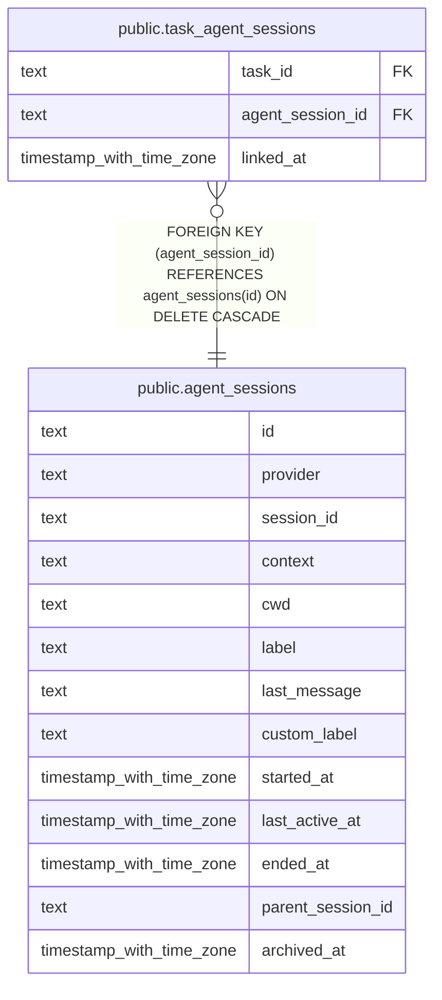

# public.agent_sessions

## Description

Sessions reported by coding agent providers.

## Columns

| Name              | Type                     | Default          | Nullable | Children                                                    | Parents | Comment                                                                                       |
| ----------------- | ------------------------ | ---------------- | -------- | ----------------------------------------------------------- | ------- | --------------------------------------------------------------------------------------------- |
| id                | text                     |                  | false    | [public.task_agent_sessions](public.task_agent_sessions.md) |         |                                                                                               |
| provider          | text                     |                  | false    |                                                             |         | Coding agent provider: claude_code or codex.                                                  |
| session_id        | text                     |                  | false    |                                                             |         | Session identifier assigned by the provider.                                                  |
| context           | text                     | 'personal'::text | false    |                                                             |         | Whether the session belongs to the work or personal context.                                  |
| cwd               | text                     |                  | false    |                                                             |         | Working directory associated with the session.                                                |
| label             | text                     |                  | true     |                                                             |         | Session label reported by the provider integration.                                           |
| last_message      | text                     |                  | true     |                                                             |         | Most recent message extracted from the session transcript.                                    |
| custom_label      | text                     |                  | true     |                                                             |         | Human-assigned session name that is kept separately from the reported label.                  |
| started_at        | timestamp with time zone | now()            | false    |                                                             |         | Time when the session was first recorded.                                                     |
| last_active_at    | timestamp with time zone | now()            | false    |                                                             |         | Time of the most recent activity report for the session.                                      |
| ended_at          | timestamp with time zone |                  | true     |                                                             |         | Time the integration last reported the session as ended; cleared by a later activity report.  |
| parent_session_id | text                     |                  | true     |                                                             |         | Raw parent session ID reported by the provider; it may be recorded before the parent session. |
| archived_at       | timestamp with time zone |                  | true     |                                                             |         | Time the session was archived by an external session manager.                                 |

## Constraints

| Name                                   | Type        | Definition                    |
| -------------------------------------- | ----------- | ----------------------------- |
| agent_sessions_context_not_null        | n           | NOT NULL context              |
| agent_sessions_cwd_not_null            | n           | NOT NULL cwd                  |
| agent_sessions_id_not_null             | n           | NOT NULL id                   |
| agent_sessions_last_active_at_not_null | n           | NOT NULL last_active_at       |
| agent_sessions_provider_not_null       | n           | NOT NULL provider             |
| agent_sessions_session_id_not_null     | n           | NOT NULL session_id           |
| agent_sessions_started_at_not_null     | n           | NOT NULL started_at           |
| agent_sessions_pkey                    | PRIMARY KEY | PRIMARY KEY (id)              |
| uq_agent_sessions_provider_session_id  | UNIQUE      | UNIQUE (provider, session_id) |

## Indexes

| Name                                  | Definition                                                                                                            |
| ------------------------------------- | --------------------------------------------------------------------------------------------------------------------- |
| agent_sessions_pkey                   | CREATE UNIQUE INDEX agent_sessions_pkey ON public.agent_sessions USING btree (id)                                     |
| uq_agent_sessions_provider_session_id | CREATE UNIQUE INDEX uq_agent_sessions_provider_session_id ON public.agent_sessions USING btree (provider, session_id) |
| idx_agent_sessions_last_active_at     | CREATE INDEX idx_agent_sessions_last_active_at ON public.agent_sessions USING btree (last_active_at)                  |

## Relations

---

> Generated by [tbls](https://github.com/k1LoW/tbls)
