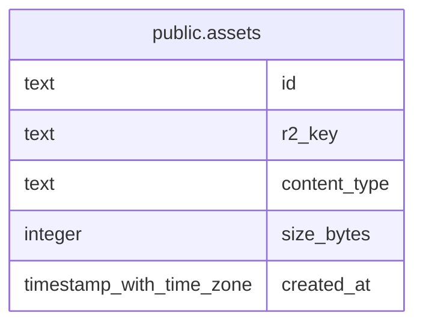

# public.assets

## Description

Metadata for uploaded assets stored in object storage.

## Columns

| Name         | Type                     | Default | Nullable | Children | Parents | Comment                                                   |
| ------------ | ------------------------ | ------- | -------- | -------- | ------- | --------------------------------------------------------- |
| id           | text                     |         | false    |          |         |                                                           |
| r2_key       | text                     |         | false    |          |         | Unique object key used to locate the asset in R2 storage. |
| content_type | text                     |         | false    |          |         | Media type of the asset.                                  |
| size_bytes   | integer                  |         | false    |          |         | Asset size in bytes.                                      |
| created_at   | timestamp with time zone | now()   | false    |          |         |                                                           |

## Constraints

| Name                         | Type        | Definition            |
| ---------------------------- | ----------- | --------------------- |
| images_content_type_not_null | n           | NOT NULL content_type |
| images_created_at_not_null   | n           | NOT NULL created_at   |
| images_id_not_null           | n           | NOT NULL id           |
| images_r2_key_not_null       | n           | NOT NULL r2_key       |
| images_size_bytes_not_null   | n           | NOT NULL size_bytes   |
| assets_pkey                  | PRIMARY KEY | PRIMARY KEY (id)      |
| assets_r2_key_unique         | UNIQUE      | UNIQUE (r2_key)       |

## Indexes

| Name                 | Definition                                                                     |
| -------------------- | ------------------------------------------------------------------------------ |
| assets_pkey          | CREATE UNIQUE INDEX assets_pkey ON public.assets USING btree (id)              |
| assets_r2_key_unique | CREATE UNIQUE INDEX assets_r2_key_unique ON public.assets USING btree (r2_key) |
| idx_assets_r2_key    | CREATE INDEX idx_assets_r2_key ON public.assets USING btree (r2_key)           |

## Relations

---

> Generated by [tbls](https://github.com/k1LoW/tbls)
