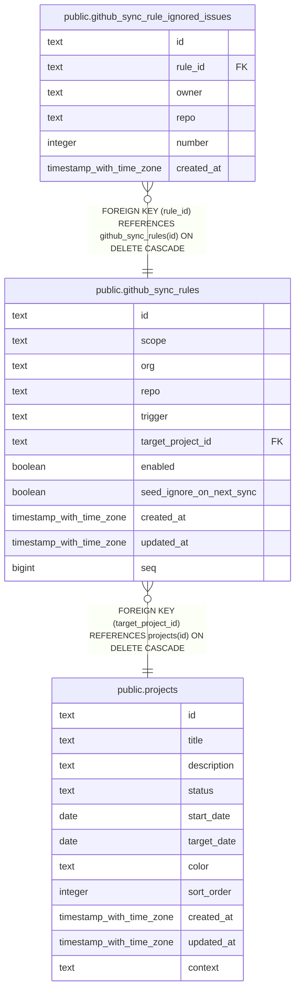

# public.github_sync_rules

## Description

GitHub synchronization rules associated with a target project.

## Columns

| Name                     | Type                     | Default          | Nullable | Children                                                                            | Parents                               | Comment                                                                                                         |
| ------------------------ | ------------------------ | ---------------- | -------- | ----------------------------------------------------------------------------------- | ------------------------------------- | --------------------------------------------------------------------------------------------------------------- |
| id                       | text                     |                  | false    | [public.github_sync_rule_ignored_issues](public.github_sync_rule_ignored_issues.md) |                                       |                                                                                                                 |
| scope                    | text                     |                  | false    |                                                                                     |                                       | Repositories covered by the rule: all, org, or repo.                                                            |
| org                      | text                     |                  | true     |                                                                                     |                                       | Organization covered by the rule when scope is org or repo.                                                     |
| repo                     | text                     |                  | true     |                                                                                     |                                       | Repository covered by the rule when scope is repo.                                                              |
| trigger                  | text                     | 'assigned'::text | false    |                                                                                     |                                       | Synchronization trigger value: assigned.                                                                        |
| target_project_id        | text                     |                  | false    |                                                                                     | [public.projects](public.projects.md) | Project associated with the rule.                                                                               |
| enabled                  | boolean                  | true             | false    |                                                                                     |                                       | Whether the rule is enabled.                                                                                    |
| seed_ignore_on_next_sync | boolean                  | false            | false    |                                                                                     |                                       | Whether the first synchronization seeds matching existing issues as ignored instead of creating tasks for them. |
| created_at               | timestamp with time zone | now()            | false    |                                                                                     |                                       |                                                                                                                 |
| updated_at               | timestamp with time zone | now()            | false    |                                                                                     |                                       |                                                                                                                 |
| seq                      | bigint                   |                  | false    |                                                                                     |                                       | Insertion-order sequence used to break ties between rules created at the same time.                             |

## Constraints

| Name                                                | Type        | Definition                                                                                                                                                                                                          |
| --------------------------------------------------- | ----------- | ------------------------------------------------------------------------------------------------------------------------------------------------------------------------------------------------------------------- |
| github_sync_rules_created_at_not_null               | n           | NOT NULL created_at                                                                                                                                                                                                 |
| github_sync_rules_enabled_not_null                  | n           | NOT NULL enabled                                                                                                                                                                                                    |
| github_sync_rules_id_not_null                       | n           | NOT NULL id                                                                                                                                                                                                         |
| github_sync_rules_scope_not_null                    | n           | NOT NULL scope                                                                                                                                                                                                      |
| github_sync_rules_scope_target_check                | CHECK       | CHECK ((((scope = 'all'::text) AND (org IS NULL) AND (repo IS NULL)) OR ((scope = 'org'::text) AND (org IS NOT NULL) AND (repo IS NULL)) OR ((scope = 'repo'::text) AND (org IS NOT NULL) AND (repo IS NOT NULL)))) |
| github_sync_rules_seed_ignore_on_next_sync_not_null | n           | NOT NULL seed_ignore_on_next_sync                                                                                                                                                                                   |
| github_sync_rules_seq_not_null                      | n           | NOT NULL seq                                                                                                                                                                                                        |
| github_sync_rules_target_project_id_not_null        | n           | NOT NULL target_project_id                                                                                                                                                                                          |
| github_sync_rules_trigger_not_null                  | n           | NOT NULL trigger                                                                                                                                                                                                    |
| github_sync_rules_updated_at_not_null               | n           | NOT NULL updated_at                                                                                                                                                                                                 |
| github_sync_rules_target_project_id_projects_id_fk  | FOREIGN KEY | FOREIGN KEY (target_project_id) REFERENCES projects(id) ON DELETE CASCADE                                                                                                                                           |
| github_sync_rules_pkey                              | PRIMARY KEY | PRIMARY KEY (id)                                                                                                                                                                                                    |

## Indexes

| Name                                    | Definition                                                                                                       |
| --------------------------------------- | ---------------------------------------------------------------------------------------------------------------- |
| github_sync_rules_pkey                  | CREATE UNIQUE INDEX github_sync_rules_pkey ON public.github_sync_rules USING btree (id)                          |
| idx_github_sync_rules_enabled           | CREATE INDEX idx_github_sync_rules_enabled ON public.github_sync_rules USING btree (enabled)                     |
| idx_github_sync_rules_target_project_id | CREATE INDEX idx_github_sync_rules_target_project_id ON public.github_sync_rules USING btree (target_project_id) |

## Relations

---

> Generated by [tbls](https://github.com/k1LoW/tbls)
