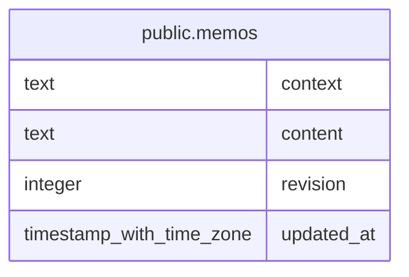

# public.memos

## Description

Markdown scratchpads stored once per work or personal context.

## Columns

| Name       | Type                     | Default  | Nullable | Children | Parents | Comment                                                        |
| ---------- | ------------------------ | -------- | -------- | -------- | ------- | -------------------------------------------------------------- |
| context    | text                     |          | false    |          |         | Context that owns the memo: work or personal.                  |
| content    | text                     | ''::text | false    |          |         | Markdown document stored for the context.                      |
| revision   | integer                  | 0        | false    |          |         | Monotonically increasing revision used to reject stale writes. |
| updated_at | timestamp with time zone | now()    | false    |          |         | Time when the memo content was last updated.                   |

## Constraints

| Name                      | Type        | Definition            |
| ------------------------- | ----------- | --------------------- |
| memos_content_not_null    | n           | NOT NULL content      |
| memos_context_not_null    | n           | NOT NULL context      |
| memos_revision_not_null   | n           | NOT NULL revision     |
| memos_updated_at_not_null | n           | NOT NULL updated_at   |
| memos_pkey                | PRIMARY KEY | PRIMARY KEY (context) |

## Indexes

| Name       | Definition                                                           |
| ---------- | -------------------------------------------------------------------- |
| memos_pkey | CREATE UNIQUE INDEX memos_pkey ON public.memos USING btree (context) |

## Relations

---

> Generated by [tbls](https://github.com/k1LoW/tbls)
