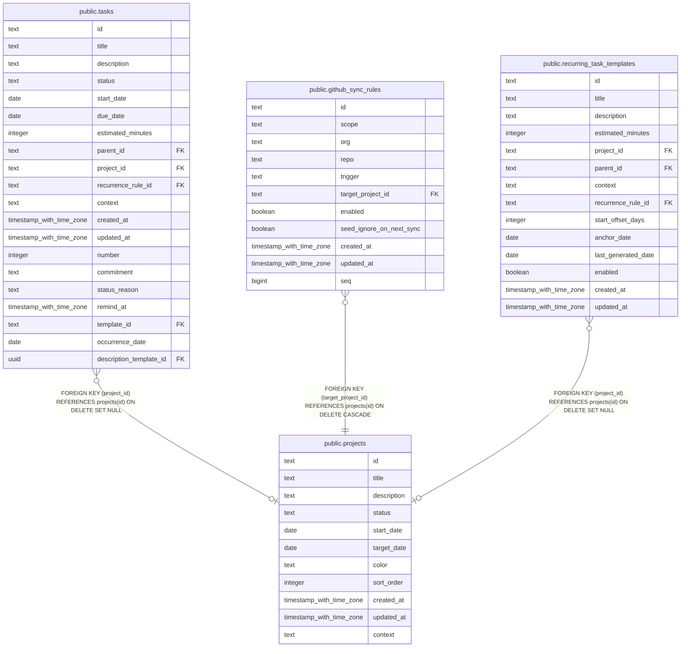

# public.projects

## Description

Projects group related tasks and track planning status and dates.

## Columns

| Name        | Type                     | Default          | Nullable | Children                                                                                                                                                      | Parents | Comment                                                           |
| ----------- | ------------------------ | ---------------- | -------- | ------------------------------------------------------------------------------------------------------------------------------------------------------------- | ------- | ----------------------------------------------------------------- |
| id          | text                     |                  | false    | [public.tasks](public.tasks.md) [public.github_sync_rules](public.github_sync_rules.md) [public.recurring_task_templates](public.recurring_task_templates.md) |         |                                                                   |
| title       | text                     |                  | false    |                                                                                                                                                               |         | Human-readable project title.                                     |
| description | text                     |                  | true     |                                                                                                                                                               |         | Optional description of the project.                              |
| status      | text                     | 'active'::text   | false    |                                                                                                                                                               |         | Project lifecycle status: active, paused, completed, or archived. |
| start_date  | date                     |                  | true     |                                                                                                                                                               |         | Planned start date for the project.                               |
| target_date | date                     |                  | true     |                                                                                                                                                               |         | Target completion date for the project.                           |
| color       | text                     |                  | true     |                                                                                                                                                               |         | Optional color value associated with the project.                 |
| sort_order  | integer                  | 0                | false    |                                                                                                                                                               |         | Position used to order projects.                                  |
| created_at  | timestamp with time zone | now()            | false    |                                                                                                                                                               |         |                                                                   |
| updated_at  | timestamp with time zone | now()            | false    |                                                                                                                                                               |         |                                                                   |
| context     | text                     | 'personal'::text | false    |                                                                                                                                                               |         | Whether the project belongs to the work or personal context.      |

## Constraints

| Name                         | Type        | Definition          |
| ---------------------------- | ----------- | ------------------- |
| projects_context_not_null    | n           | NOT NULL context    |
| projects_created_at_not_null | n           | NOT NULL created_at |
| projects_id_not_null         | n           | NOT NULL id         |
| projects_sort_order_not_null | n           | NOT NULL sort_order |
| projects_status_not_null     | n           | NOT NULL status     |
| projects_title_not_null      | n           | NOT NULL title      |
| projects_updated_at_not_null | n           | NOT NULL updated_at |
| projects_pkey                | PRIMARY KEY | PRIMARY KEY (id)    |

## Indexes

| Name                    | Definition                                                                       |
| ----------------------- | -------------------------------------------------------------------------------- |
| projects_pkey           | CREATE UNIQUE INDEX projects_pkey ON public.projects USING btree (id)            |
| idx_projects_status     | CREATE INDEX idx_projects_status ON public.projects USING btree (status)         |
| idx_projects_sort_order | CREATE INDEX idx_projects_sort_order ON public.projects USING btree (sort_order) |
| idx_projects_context    | CREATE INDEX idx_projects_context ON public.projects USING btree (context)       |

## Relations

---

> Generated by [tbls](https://github.com/k1LoW/tbls)
