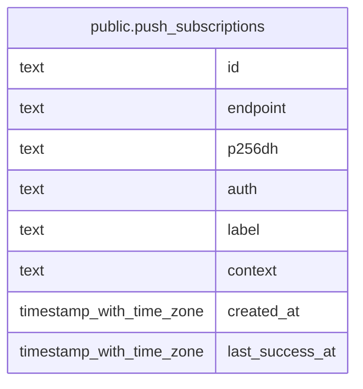

# public.push_subscriptions

## Description

Browser push endpoints and encryption credentials registered for notifications.

## Columns

| Name            | Type                     | Default | Nullable | Children | Parents | Comment                                                                                  |
| --------------- | ------------------------ | ------- | -------- | -------- | ------- | ---------------------------------------------------------------------------------------- |
| id              | text                     |         | false    |          |         |                                                                                          |
| endpoint        | text                     |         | false    |          |         | Push service URL identifying the browser subscription.                                   |
| p256dh          | text                     |         | false    |          |         | Public key used to encrypt notification payloads for this endpoint.                      |
| auth            | text                     |         | false    |          |         | Authentication secret used with this push endpoint.                                      |
| label           | text                     |         | true     |          |         | Device name derived from the browser's User-Agent.                                       |
| context         | text                     |         | false    |          |         | Work or personal context targeted by notifications for this device.                      |
| created_at      | timestamp with time zone | now()   | false    |          |         |                                                                                          |
| last_success_at | timestamp with time zone |         | true     |          |         | Time of the most recent successful notification delivery; null before the first success. |

## Constraints

| Name                                   | Type        | Definition          |
| -------------------------------------- | ----------- | ------------------- |
| push_subscriptions_auth_not_null       | n           | NOT NULL auth       |
| push_subscriptions_context_not_null    | n           | NOT NULL context    |
| push_subscriptions_created_at_not_null | n           | NOT NULL created_at |
| push_subscriptions_endpoint_not_null   | n           | NOT NULL endpoint   |
| push_subscriptions_id_not_null         | n           | NOT NULL id         |
| push_subscriptions_p256dh_not_null     | n           | NOT NULL p256dh     |
| push_subscriptions_pkey                | PRIMARY KEY | PRIMARY KEY (id)    |
| push_subscriptions_endpoint_unique     | UNIQUE      | UNIQUE (endpoint)   |

## Indexes

| Name                               | Definition                                                                                                 |
| ---------------------------------- | ---------------------------------------------------------------------------------------------------------- |
| push_subscriptions_pkey            | CREATE UNIQUE INDEX push_subscriptions_pkey ON public.push_subscriptions USING btree (id)                  |
| push_subscriptions_endpoint_unique | CREATE UNIQUE INDEX push_subscriptions_endpoint_unique ON public.push_subscriptions USING btree (endpoint) |

## Relations

---

> Generated by [tbls](https://github.com/k1LoW/tbls)
