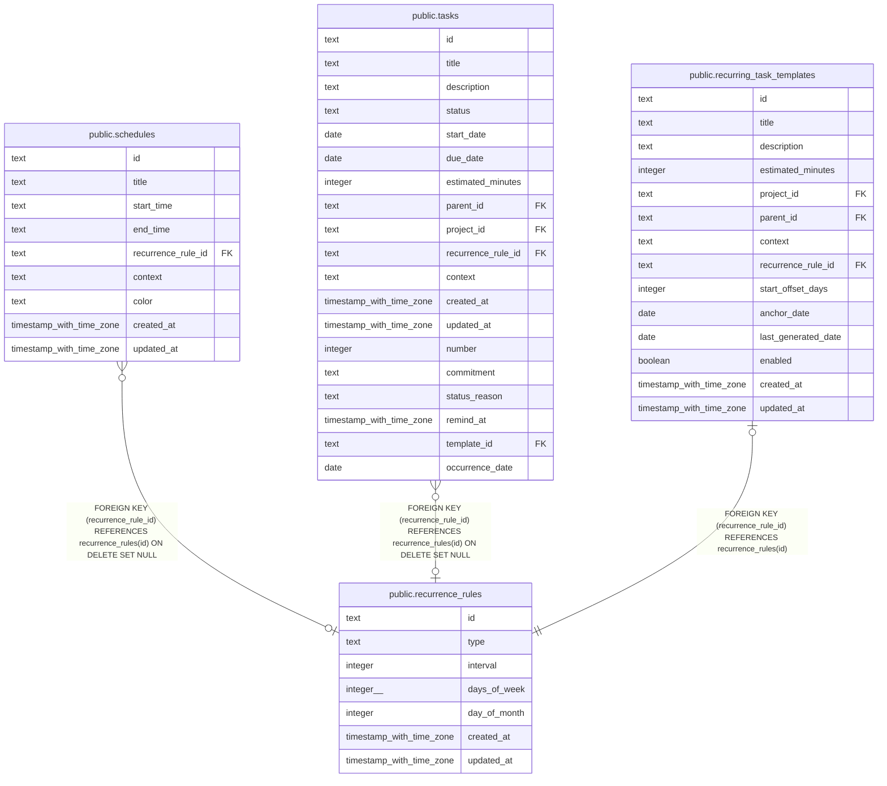

# public.recurrence_rules

## Description

Recurrence definitions referenced by tasks, schedules, and recurring task templates.

## Columns

| Name         | Type                     | Default | Nullable | Children                                                                                                                                      | Parents | Comment                                                                         |
| ------------ | ------------------------ | ------- | -------- | --------------------------------------------------------------------------------------------------------------------------------------------- | ------- | ------------------------------------------------------------------------------- |
| id           | text                     |         | false    | [public.schedules](public.schedules.md) [public.tasks](public.tasks.md) [public.recurring_task_templates](public.recurring_task_templates.md) |         |                                                                                 |
| type         | text                     |         | false    |                                                                                                                                               |         | Recurrence unit or pattern: daily, weekly, monthly, or custom.                  |
| interval     | integer                  | 1       | false    |                                                                                                                                               |         | Number of recurrence units between occurrences.                                 |
| days_of_week | integer[]                |         | true     |                                                                                                                                               |         | Days selected for weekly recurrence, using 0 for Sunday through 6 for Saturday. |
| day_of_month | integer                  |         | true     |                                                                                                                                               |         | Calendar day selected for monthly recurrence, from 1 through 31.                |
| created_at   | timestamp with time zone | now()   | false    |                                                                                                                                               |         |                                                                                 |
| updated_at   | timestamp with time zone | now()   | false    |                                                                                                                                               |         |                                                                                 |

## Constraints

| Name                                 | Type        | Definition          |
| ------------------------------------ | ----------- | ------------------- |
| recurrence_rules_created_at_not_null | n           | NOT NULL created_at |
| recurrence_rules_id_not_null         | n           | NOT NULL id         |
| recurrence_rules_interval_not_null   | n           | NOT NULL "interval" |
| recurrence_rules_type_not_null       | n           | NOT NULL type       |
| recurrence_rules_updated_at_not_null | n           | NOT NULL updated_at |
| recurrence_rules_pkey                | PRIMARY KEY | PRIMARY KEY (id)    |

## Indexes

| Name                  | Definition                                                                            |
| --------------------- | ------------------------------------------------------------------------------------- |
| recurrence_rules_pkey | CREATE UNIQUE INDEX recurrence_rules_pkey ON public.recurrence_rules USING btree (id) |

## Relations

---

> Generated by [tbls](https://github.com/k1LoW/tbls)
