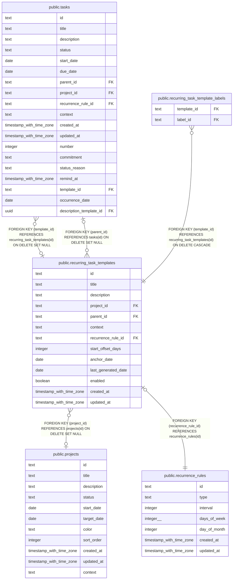

# public.recurring_task_templates

## Description

Definitions used by the scheduler to create recurring task instances.

## Columns

| Name                | Type                     | Default          | Nullable | Children                                                                                                          | Parents                                               | Comment                                                                                          |
| ------------------- | ------------------------ | ---------------- | -------- | ----------------------------------------------------------------------------------------------------------------- | ----------------------------------------------------- | ------------------------------------------------------------------------------------------------ |
| id                  | text                     |                  | false    | [public.tasks](public.tasks.md) [public.recurring_task_template_labels](public.recurring_task_template_labels.md) |                                                       |                                                                                                  |
| title               | text                     |                  | false    |                                                                                                                   |                                                       | Title copied to each generated task.                                                             |
| description         | text                     |                  | true     |                                                                                                                   |                                                       | Optional task details copied to generated tasks.                                                 |
| project_id          | text                     |                  | true     |                                                                                                                   | [public.projects](public.projects.md)                 | Project associated with generated tasks.                                                         |
| parent_id           | text                     |                  | true     |                                                                                                                   | [public.tasks](public.tasks.md)                       | Task under which each generated task is nested.                                                  |
| context             | text                     | 'personal'::text | false    |                                                                                                                   |                                                       | Whether generated tasks belong to the work or personal context.                                  |
| recurrence_rule_id  | text                     |                  | false    |                                                                                                                   | [public.recurrence_rules](public.recurrence_rules.md) | Recurrence rule used to determine occurrence dates; each rule belongs to one template.           |
| start_offset_days   | integer                  |                  | true     |                                                                                                                   |                                                       | Days before the due date to set a generated task's start date; null leaves the start date unset. |
| anchor_date         | date                     |                  | false    |                                                                                                                   |                                                       | Base date used to calculate the first occurrence.                                                |
| last_generated_date | date                     |                  | true     |                                                                                                                   |                                                       | Date of the most recent occurrence generated by the scheduler.                                   |
| enabled             | boolean                  | true             | false    |                                                                                                                   |                                                       | Whether the scheduler may generate future occurrences from this template.                        |
| created_at          | timestamp with time zone | now()            | false    |                                                                                                                   |                                                       |                                                                                                  |
| updated_at          | timestamp with time zone | now()            | false    |                                                                                                                   |                                                       |                                                                                                  |

## Constraints

| Name                                                            | Type        | Definition                                                          |
| --------------------------------------------------------------- | ----------- | ------------------------------------------------------------------- |
| recurring_task_templates_anchor_date_not_null                   | n           | NOT NULL anchor_date                                                |
| recurring_task_templates_context_not_null                       | n           | NOT NULL context                                                    |
| recurring_task_templates_created_at_not_null                    | n           | NOT NULL created_at                                                 |
| recurring_task_templates_enabled_not_null                       | n           | NOT NULL enabled                                                    |
| recurring_task_templates_id_not_null                            | n           | NOT NULL id                                                         |
| recurring_task_templates_recurrence_rule_id_not_null            | n           | NOT NULL recurrence_rule_id                                         |
| recurring_task_templates_start_offset_days_check                | CHECK       | CHECK ((start_offset_days >= 0))                                    |
| recurring_task_templates_title_not_null                         | n           | NOT NULL title                                                      |
| recurring_task_templates_updated_at_not_null                    | n           | NOT NULL updated_at                                                 |
| recurring_task_templates_project_id_projects_id_fk              | FOREIGN KEY | FOREIGN KEY (project_id) REFERENCES projects(id) ON DELETE SET NULL |
| recurring_task_templates_recurrence_rule_id_recurrence_rules_id | FOREIGN KEY | FOREIGN KEY (recurrence_rule_id) REFERENCES recurrence_rules(id)    |
| recurring_task_templates_parent_id_tasks_id_fk                  | FOREIGN KEY | FOREIGN KEY (parent_id) REFERENCES tasks(id) ON DELETE SET NULL     |
| recurring_task_templates_pkey                                   | PRIMARY KEY | PRIMARY KEY (id)                                                    |
| recurring_task_templates_recurrence_rule_id_unique              | UNIQUE      | UNIQUE (recurrence_rule_id)                                         |

## Indexes

| Name                                               | Definition                                                                                                                                 |
| -------------------------------------------------- | ------------------------------------------------------------------------------------------------------------------------------------------ |
| recurring_task_templates_pkey                      | CREATE UNIQUE INDEX recurring_task_templates_pkey ON public.recurring_task_templates USING btree (id)                                      |
| idx_recurring_task_templates_project_id            | CREATE INDEX idx_recurring_task_templates_project_id ON public.recurring_task_templates USING btree (project_id)                           |
| idx_recurring_task_templates_parent_id             | CREATE INDEX idx_recurring_task_templates_parent_id ON public.recurring_task_templates USING btree (parent_id)                             |
| idx_recurring_task_templates_context               | CREATE INDEX idx_recurring_task_templates_context ON public.recurring_task_templates USING btree (context)                                 |
| idx_recurring_task_templates_enabled               | CREATE INDEX idx_recurring_task_templates_enabled ON public.recurring_task_templates USING btree (enabled)                                 |
| recurring_task_templates_recurrence_rule_id_unique | CREATE UNIQUE INDEX recurring_task_templates_recurrence_rule_id_unique ON public.recurring_task_templates USING btree (recurrence_rule_id) |

## Relations

---

> Generated by [tbls](https://github.com/k1LoW/tbls)
