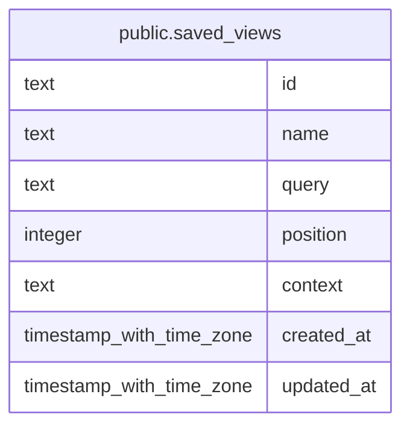

# public.saved_views

## Description

Saved task searches with a display name, query, context, and position.

## Columns

| Name       | Type                     | Default          | Nullable | Children | Parents | Comment                                                         |
| ---------- | ------------------------ | ---------------- | -------- | -------- | ------- | --------------------------------------------------------------- |
| id         | text                     |                  | false    |          |         |                                                                 |
| name       | text                     |                  | false    |          |         | Human-readable name of the saved view.                          |
| query      | text                     |                  | false    |          |         | Raw search DSL query used by the saved view.                    |
| position   | integer                  | 0                | false    |          |         | Position used to order saved views.                             |
| context    | text                     | 'personal'::text | false    |          |         | Whether the saved view belongs to the work or personal context. |
| created_at | timestamp with time zone | now()            | false    |          |         |                                                                 |
| updated_at | timestamp with time zone | now()            | false    |          |         |                                                                 |

## Constraints

| Name             | Type        | Definition       |
| ---------------- | ----------- | ---------------- |
| saved_views_pkey | PRIMARY KEY | PRIMARY KEY (id) |

## Indexes

| Name                     | Definition                                                                           |
| ------------------------ | ------------------------------------------------------------------------------------ |
| saved_views_pkey         | CREATE UNIQUE INDEX saved_views_pkey ON public.saved_views USING btree (id)          |
| idx_saved_views_context  | CREATE INDEX idx_saved_views_context ON public.saved_views USING btree (context)     |
| idx_saved_views_position | CREATE INDEX idx_saved_views_position ON public.saved_views USING btree ("position") |

## Relations

---

> Generated by [tbls](https://github.com/k1LoW/tbls)
