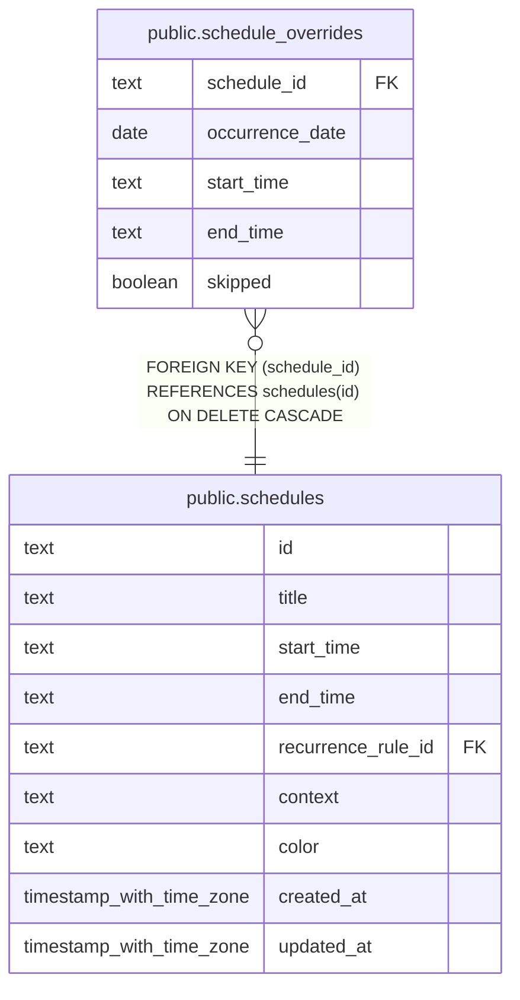

# public.schedule_overrides

## Description

One-day time changes and skipped occurrences for recurring schedules.

## Columns

| Name            | Type    | Default | Nullable | Children | Parents                                 | Comment                                                                  |
| --------------- | ------- | ------- | -------- | -------- | --------------------------------------- | ------------------------------------------------------------------------ |
| schedule_id     | text    |         | false    |          | [public.schedules](public.schedules.md) | Recurring schedule whose occurrence is changed.                          |
| occurrence_date | date    |         | false    |          |                                         | Date on which the changed occurrence starts.                             |
| start_time      | text    |         | true     |          |                                         | Replacement local start time in 24-hour HH:MM format; null when skipped. |
| end_time        | text    |         | true     |          |                                         | Replacement local end time in 24-hour HH:MM format; null when skipped.   |
| skipped         | boolean | false   | false    |          |                                         | Whether the occurrence is omitted for this date.                         |

## Constraints

| Name                                           | Type        | Definition                                                                                                                                     |
| ---------------------------------------------- | ----------- | ---------------------------------------------------------------------------------------------------------------------------------------------- |
| schedule_overrides_occurrence_date_not_null    | n           | NOT NULL occurrence_date                                                                                                                       |
| schedule_overrides_schedule_id_not_null        | n           | NOT NULL schedule_id                                                                                                                           |
| schedule_overrides_skipped_not_null            | n           | NOT NULL skipped                                                                                                                               |
| schedule_overrides_time_or_skip_check          | CHECK       | CHECK (((skipped AND (start_time IS NULL) AND (end_time IS NULL)) OR ((NOT skipped) AND (start_time IS NOT NULL) AND (end_time IS NOT NULL)))) |
| schedule_overrides_schedule_id_schedules_id_fk | FOREIGN KEY | FOREIGN KEY (schedule_id) REFERENCES schedules(id) ON DELETE CASCADE                                                                           |
| schedule_overrides_schedule_date_unique        | UNIQUE      | UNIQUE (schedule_id, occurrence_date)                                                                                                          |

## Indexes

| Name                                    | Definition                                                                                                                          |
| --------------------------------------- | ----------------------------------------------------------------------------------------------------------------------------------- |
| schedule_overrides_schedule_date_unique | CREATE UNIQUE INDEX schedule_overrides_schedule_date_unique ON public.schedule_overrides USING btree (schedule_id, occurrence_date) |

## Relations

---

> Generated by [tbls](https://github.com/k1LoW/tbls)
