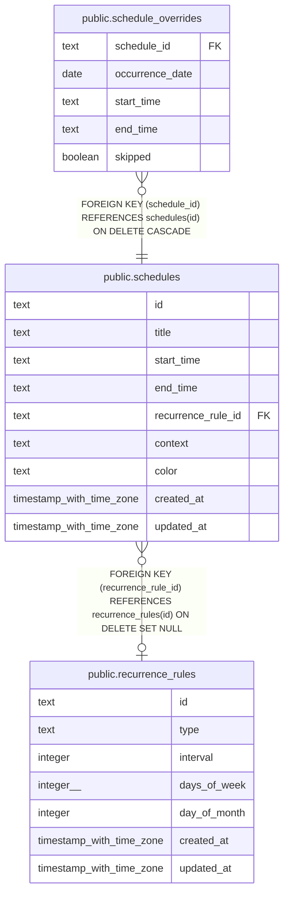

# public.schedules

## Description

Recurring calendar schedules with a local time range and optional recurrence rule.

## Columns

| Name               | Type                     | Default          | Nullable | Children                                                  | Parents                                               | Comment                                                                     |
| ------------------ | ------------------------ | ---------------- | -------- | --------------------------------------------------------- | ----------------------------------------------------- | --------------------------------------------------------------------------- |
| id                 | text                     |                  | false    | [public.schedule_overrides](public.schedule_overrides.md) |                                                       |                                                                             |
| title              | text                     |                  | false    |                                                           |                                                       | Human-readable schedule title.                                              |
| start_time         | text                     |                  | false    |                                                           |                                                       | Local start time of the schedule in 24-hour HH:MM format.                   |
| end_time           | text                     |                  | false    |                                                           |                                                       | Local end time of the schedule in 24-hour HH:MM format.                     |
| recurrence_rule_id | text                     |                  | true     |                                                           | [public.recurrence_rules](public.recurrence_rules.md) | Recurrence rule associated with the schedule; null for a one-time schedule. |
| context            | text                     | 'personal'::text | false    |                                                           |                                                       | Whether the schedule belongs to the work or personal context.               |
| color              | text                     |                  | true     |                                                           |                                                       | Optional color value associated with the schedule.                          |
| created_at         | timestamp with time zone | now()            | false    |                                                           |                                                       |                                                                             |
| updated_at         | timestamp with time zone | now()            | false    |                                                           |                                                       |                                                                             |

## Constraints

| Name                                                | Type        | Definition                                                                          |
| --------------------------------------------------- | ----------- | ----------------------------------------------------------------------------------- |
| schedules_context_not_null                          | n           | NOT NULL context                                                                    |
| schedules_created_at_not_null                       | n           | NOT NULL created_at                                                                 |
| schedules_end_time_not_null                         | n           | NOT NULL end_time                                                                   |
| schedules_id_not_null                               | n           | NOT NULL id                                                                         |
| schedules_start_time_not_null                       | n           | NOT NULL start_time                                                                 |
| schedules_title_not_null                            | n           | NOT NULL title                                                                      |
| schedules_updated_at_not_null                       | n           | NOT NULL updated_at                                                                 |
| schedules_recurrence_rule_id_recurrence_rules_id_fk | FOREIGN KEY | FOREIGN KEY (recurrence_rule_id) REFERENCES recurrence_rules(id) ON DELETE SET NULL |
| schedules_pkey                                      | PRIMARY KEY | PRIMARY KEY (id)                                                                    |

## Indexes

| Name                             | Definition                                                                                         |
| -------------------------------- | -------------------------------------------------------------------------------------------------- |
| schedules_pkey                   | CREATE UNIQUE INDEX schedules_pkey ON public.schedules USING btree (id)                            |
| idx_schedules_recurrence_rule_id | CREATE INDEX idx_schedules_recurrence_rule_id ON public.schedules USING btree (recurrence_rule_id) |
| idx_schedules_context            | CREATE INDEX idx_schedules_context ON public.schedules USING btree (context)                       |

## Relations

---

> Generated by [tbls](https://github.com/k1LoW/tbls)
