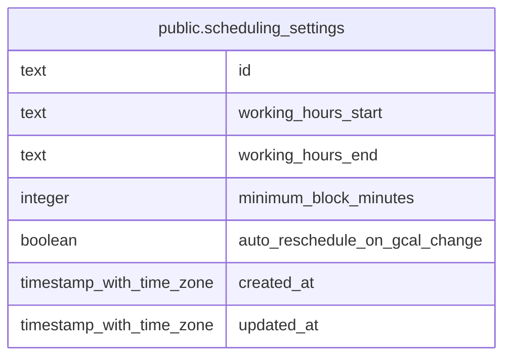

# public.scheduling_settings

## Description

Singleton preferences for task scheduling.

## Columns

| Name                           | Type                     | Default           | Nullable | Children | Parents | Comment                                                                         |
| ------------------------------ | ------------------------ | ----------------- | -------- | -------- | ------- | ------------------------------------------------------------------------------- |
| id                             | text                     | 'singleton'::text | false    |          |         |                                                                                 |
| working_hours_start            | text                     | '09:00'::text     | false    |          |         | Start of the working-hours window in local 24-hour HH:MM format.                |
| working_hours_end              | text                     | '19:00'::text     | false    |          |         | End of the working-hours window in local 24-hour HH:MM format.                  |
| minimum_block_minutes          | integer                  | 30                | false    |          |         | Minimum scheduling block length, in minutes.                                    |
| auto_reschedule_on_gcal_change | boolean                  | true              | false    |          |         | Whether task blocks are automatically rescheduled when Google Calendar changes. |
| created_at                     | timestamp with time zone | now()             | false    |          |         |                                                                                 |
| updated_at                     | timestamp with time zone | now()             | false    |          |         |                                                                                 |

## Constraints

| Name                                                        | Type        | Definition                                        |
| ----------------------------------------------------------- | ----------- | ------------------------------------------------- |
| scheduling_settings_auto_reschedule_on_gcal_change_not_null | n           | NOT NULL auto_reschedule_on_gcal_change           |
| scheduling_settings_created_at_not_null                     | n           | NOT NULL created_at                               |
| scheduling_settings_id_not_null                             | n           | NOT NULL id                                       |
| scheduling_settings_minimum_block_minutes_not_null          | n           | NOT NULL minimum_block_minutes                    |
| scheduling_settings_minimum_block_minutes_positive_check    | CHECK       | CHECK ((minimum_block_minutes > 0))               |
| scheduling_settings_singleton_check                         | CHECK       | CHECK ((id = 'singleton'::text))                  |
| scheduling_settings_updated_at_not_null                     | n           | NOT NULL updated_at                               |
| scheduling_settings_working_hours_end_not_null              | n           | NOT NULL working_hours_end                        |
| scheduling_settings_working_hours_format_check              | CHECK       | CHECK (((working_hours_start ~ '^([01][0-9]       | 2[0-3]):[0-5][0-9]$'::text) AND (working_hours_end ~ '^([01][0-9] | 2[0-3]):[0-5][0-9]$'::text))) |
| scheduling_settings_working_hours_order_check               | CHECK       | CHECK ((working_hours_start < working_hours_end)) |
| scheduling_settings_working_hours_start_not_null            | n           | NOT NULL working_hours_start                      |
| scheduling_settings_pkey                                    | PRIMARY KEY | PRIMARY KEY (id)                                  |

## Indexes

| Name                     | Definition                                                                                  |
| ------------------------ | ------------------------------------------------------------------------------------------- |
| scheduling_settings_pkey | CREATE UNIQUE INDEX scheduling_settings_pkey ON public.scheduling_settings USING btree (id) |

## Relations

---

> Generated by [tbls](https://github.com/k1LoW/tbls)
