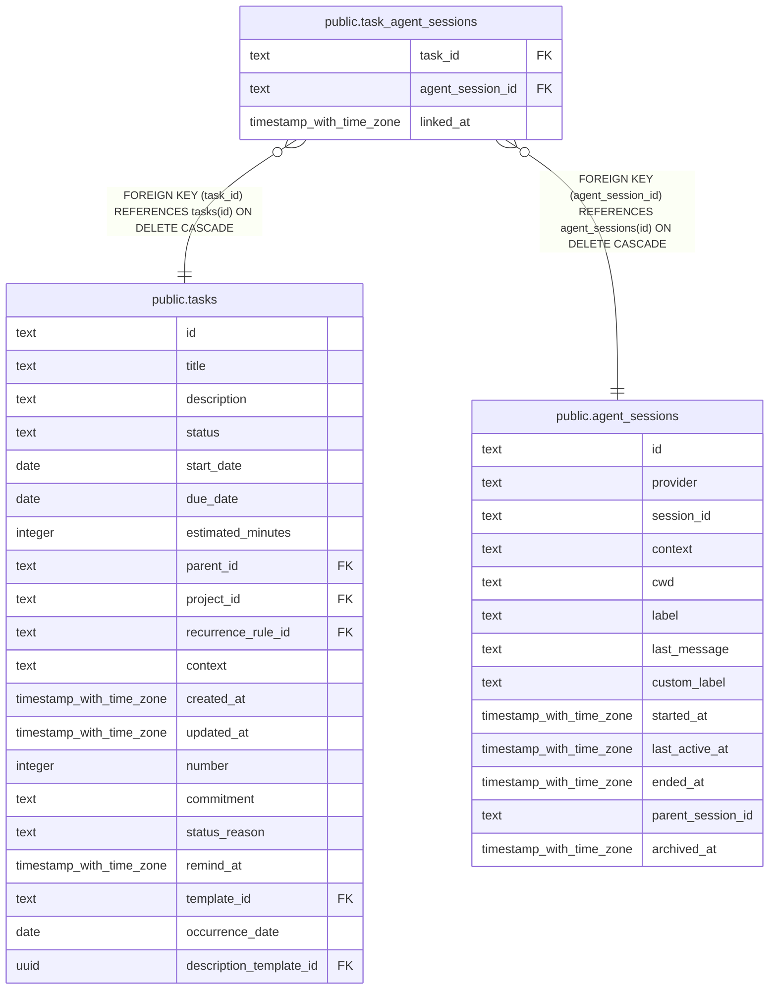

# public.task_agent_sessions

## Description

Associations between tasks and coding agent sessions.

## Columns

| Name             | Type                     | Default | Nullable | Children | Parents                                           | Comment                                                                                        |
| ---------------- | ------------------------ | ------- | -------- | -------- | ------------------------------------------------- | ---------------------------------------------------------------------------------------------- |
| task_id          | text                     |         | false    |          | [public.tasks](public.tasks.md)                   | Task associated with the agent session.                                                        |
| agent_session_id | text                     |         | false    |          | [public.agent_sessions](public.agent_sessions.md) | Agent session associated with the task.                                                        |
| linked_at        | timestamp with time zone | now()   | false    |          |                                                   | Time when the task was linked to the agent session; existing links receive the migration time. |

## Constraints

| Name                                                      | Type        | Definition                                                                     |
| --------------------------------------------------------- | ----------- | ------------------------------------------------------------------------------ |
| task_agent_sessions_agent_session_id_not_null             | n           | NOT NULL agent_session_id                                                      |
| task_agent_sessions_linked_at_not_null                    | n           | NOT NULL linked_at                                                             |
| task_agent_sessions_task_id_not_null                      | n           | NOT NULL task_id                                                               |
| task_agent_sessions_task_id_tasks_id_fk                   | FOREIGN KEY | FOREIGN KEY (task_id) REFERENCES tasks(id) ON DELETE CASCADE                   |
| task_agent_sessions_agent_session_id_agent_sessions_id_fk | FOREIGN KEY | FOREIGN KEY (agent_session_id) REFERENCES agent_sessions(id) ON DELETE CASCADE |
| task_agent_sessions_task_id_agent_session_id_pk           | PRIMARY KEY | PRIMARY KEY (task_id, agent_session_id)                                        |

## Indexes

| Name                                            | Definition                                                                                                                                |
| ----------------------------------------------- | ----------------------------------------------------------------------------------------------------------------------------------------- |
| task_agent_sessions_task_id_agent_session_id_pk | CREATE UNIQUE INDEX task_agent_sessions_task_id_agent_session_id_pk ON public.task_agent_sessions USING btree (task_id, agent_session_id) |
| idx_task_agent_sessions_task_id                 | CREATE INDEX idx_task_agent_sessions_task_id ON public.task_agent_sessions USING btree (task_id)                                          |
| idx_task_agent_sessions_agent_session_id        | CREATE INDEX idx_task_agent_sessions_agent_session_id ON public.task_agent_sessions USING btree (agent_session_id)                        |

## Relations

---

> Generated by [tbls](https://github.com/k1LoW/tbls)
