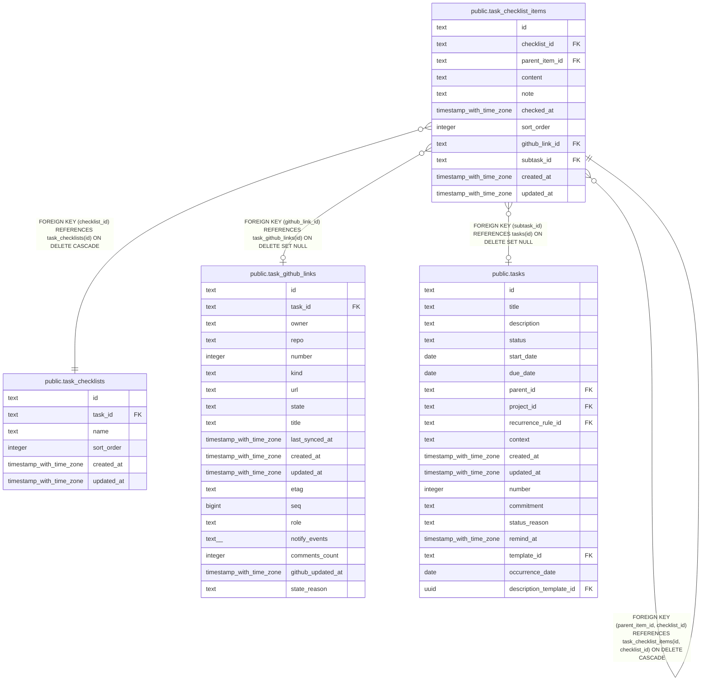

# public.task_checklist_items

## Description

Nested checklist items with completion state and optional Markdown detail.

## Columns

| Name           | Type                     | Default | Nullable | Children                                                      | Parents                                                                                                           | Comment                                                    |
| -------------- | ------------------------ | ------- | -------- | ------------------------------------------------------------- | ----------------------------------------------------------------------------------------------------------------- | ---------------------------------------------------------- |
| id             | text                     |         | false    | [public.task_checklist_items](public.task_checklist_items.md) |                                                                                                                   |                                                            |
| checklist_id   | text                     |         | false    | [public.task_checklist_items](public.task_checklist_items.md) | [public.task_checklist_items](public.task_checklist_items.md) [public.task_checklists](public.task_checklists.md) | Checklist that owns this item.                             |
| parent_item_id | text                     |         | true     |                                                               | [public.task_checklist_items](public.task_checklist_items.md)                                                     | Parent item in the same checklist; null for a root item.   |
| content        | text                     |         | false    |                                                               |                                                                                                                   | Single-line item text.                                     |
| note           | text                     |         | true     |                                                               |                                                                                                                   | Optional Markdown detail for the item.                     |
| checked_at     | timestamp with time zone |         | true     |                                                               |                                                                                                                   | Time when the item was checked; null while unchecked.      |
| sort_order     | integer                  | 0       | false    |                                                               |                                                                                                                   | Position among items with the same parent.                 |
| github_link_id | text                     |         | true     |                                                               | [public.task_github_links](public.task_github_links.md)                                                           | Optional GitHub issue or pull request linked to this item. |
| subtask_id     | text                     |         | true     |                                                               | [public.tasks](public.tasks.md)                                                                                   | Optional task linked to this item as a subtask.            |
| created_at     | timestamp with time zone | now()   | false    |                                                               |                                                                                                                   |                                                            |
| updated_at     | timestamp with time zone | now()   | false    |                                                               |                                                                                                                   |                                                            |

## Constraints

| Name                                                        | Type        | Definition                                                                                                     |
| ----------------------------------------------------------- | ----------- | -------------------------------------------------------------------------------------------------------------- |
| task_checklist_items_checklist_id_not_null                  | n           | NOT NULL checklist_id                                                                                          |
| task_checklist_items_content_not_null                       | n           | NOT NULL content                                                                                               |
| task_checklist_items_created_at_not_null                    | n           | NOT NULL created_at                                                                                            |
| task_checklist_items_id_not_null                            | n           | NOT NULL id                                                                                                    |
| task_checklist_items_link_exclusive_check                   | CHECK       | CHECK ((NOT ((github_link_id IS NOT NULL) AND (subtask_id IS NOT NULL))))                                      |
| task_checklist_items_sort_order_not_null                    | n           | NOT NULL sort_order                                                                                            |
| task_checklist_items_updated_at_not_null                    | n           | NOT NULL updated_at                                                                                            |
| task_checklist_items_subtask_id_tasks_id_fk                 | FOREIGN KEY | FOREIGN KEY (subtask_id) REFERENCES tasks(id) ON DELETE SET NULL                                               |
| task_checklist_items_github_link_id_task_github_links_id_fk | FOREIGN KEY | FOREIGN KEY (github_link_id) REFERENCES task_github_links(id) ON DELETE SET NULL                               |
| task_checklist_items_pkey                                   | PRIMARY KEY | PRIMARY KEY (id)                                                                                               |
| fk_task_checklist_items_parent_same_checklist               | FOREIGN KEY | FOREIGN KEY (parent_item_id, checklist_id) REFERENCES task_checklist_items(id, checklist_id) ON DELETE CASCADE |
| uq_task_checklist_items_id_checklist_id                     | UNIQUE      | UNIQUE (id, checklist_id)                                                                                      |
| task_checklist_items_checklist_id_task_checklists_id_fk     | FOREIGN KEY | FOREIGN KEY (checklist_id) REFERENCES task_checklists(id) ON DELETE CASCADE                                    |

## Indexes

| Name                                              | Definition                                                                                                                                           |
| ------------------------------------------------- | ---------------------------------------------------------------------------------------------------------------------------------------------------- |
| task_checklist_items_pkey                         | CREATE UNIQUE INDEX task_checklist_items_pkey ON public.task_checklist_items USING btree (id)                                                        |
| uq_task_checklist_items_id_checklist_id           | CREATE UNIQUE INDEX uq_task_checklist_items_id_checklist_id ON public.task_checklist_items USING btree (id, checklist_id)                            |
| idx_task_checklist_items_checklist_id_parent_sort | CREATE INDEX idx_task_checklist_items_checklist_id_parent_sort ON public.task_checklist_items USING btree (checklist_id, parent_item_id, sort_order) |
| idx_task_checklist_items_github_link_id           | CREATE INDEX idx_task_checklist_items_github_link_id ON public.task_checklist_items USING btree (github_link_id) WHERE (github_link_id IS NOT NULL)  |
| idx_task_checklist_items_subtask_id               | CREATE INDEX idx_task_checklist_items_subtask_id ON public.task_checklist_items USING btree (subtask_id) WHERE (subtask_id IS NOT NULL)              |

## Relations

---

> Generated by [tbls](https://github.com/k1LoW/tbls)
