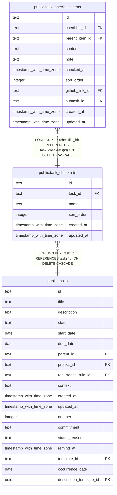

# public.task_checklists

## Description

Named or unnamed checklists associated with tasks.

## Columns

| Name       | Type                     | Default | Nullable | Children                                                      | Parents                         | Comment                                     |
| ---------- | ------------------------ | ------- | -------- | ------------------------------------------------------------- | ------------------------------- | ------------------------------------------- |
| id         | text                     |         | false    | [public.task_checklist_items](public.task_checklist_items.md) |                                 |                                             |
| task_id    | text                     |         | false    |                                                               | [public.tasks](public.tasks.md) | Task that owns this checklist.              |
| name       | text                     |         | true     |                                                               |                                 | Optional display name for the checklist.    |
| sort_order | integer                  | 0       | false    |                                                               |                                 | Position used to order the task checklists. |
| created_at | timestamp with time zone | now()   | false    |                                                               |                                 |                                             |
| updated_at | timestamp with time zone | now()   | false    |                                                               |                                 |                                             |

## Constraints

| Name                                | Type        | Definition                                                   |
| ----------------------------------- | ----------- | ------------------------------------------------------------ |
| task_checklists_created_at_not_null | n           | NOT NULL created_at                                          |
| task_checklists_id_not_null         | n           | NOT NULL id                                                  |
| task_checklists_sort_order_not_null | n           | NOT NULL sort_order                                          |
| task_checklists_task_id_not_null    | n           | NOT NULL task_id                                             |
| task_checklists_updated_at_not_null | n           | NOT NULL updated_at                                          |
| task_checklists_task_id_tasks_id_fk | FOREIGN KEY | FOREIGN KEY (task_id) REFERENCES tasks(id) ON DELETE CASCADE |
| task_checklists_pkey                | PRIMARY KEY | PRIMARY KEY (id)                                             |

## Indexes

| Name                                   | Definition                                                                                                      |
| -------------------------------------- | --------------------------------------------------------------------------------------------------------------- |
| task_checklists_pkey                   | CREATE UNIQUE INDEX task_checklists_pkey ON public.task_checklists USING btree (id)                             |
| idx_task_checklists_task_id_sort_order | CREATE INDEX idx_task_checklists_task_id_sort_order ON public.task_checklists USING btree (task_id, sort_order) |

## Relations

---

> Generated by [tbls](https://github.com/k1LoW/tbls)
