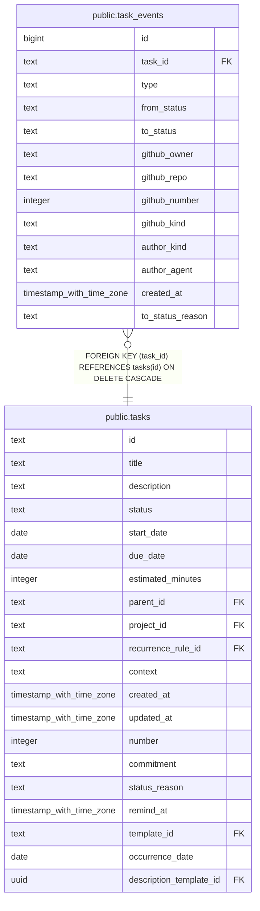

# public.task_events

## Description

Task status changes and GitHub link or unlink events shown in the activity timeline.

## Columns

| Name             | Type                     | Default | Nullable | Children | Parents                         | Comment                                                                              |
| ---------------- | ------------------------ | ------- | -------- | -------- | ------------------------------- | ------------------------------------------------------------------------------------ |
| id               | bigint                   |         | false    |          |                                 |                                                                                      |
| task_id          | text                     |         | false    |          | [public.tasks](public.tasks.md) | Task associated with this event.                                                     |
| type             | text                     |         | false    |          |                                 | Event category: status_changed, github_linked, or github_unlinked.                   |
| from_status      | text                     |         | true     |          |                                 | Previous status for a status_changed event: todo, in_progress, or completed.         |
| to_status        | text                     |         | true     |          |                                 | New status for a status_changed event: todo, in_progress, or completed.              |
| github_owner     | text                     |         | true     |          |                                 | Owner of the linked GitHub repository.                                               |
| github_repo      | text                     |         | true     |          |                                 | Name of the linked GitHub repository.                                                |
| github_number    | integer                  |         | true     |          |                                 | Number of the linked GitHub issue or pull request.                                   |
| github_kind      | text                     |         | true     |          |                                 | Linked GitHub item type: issue or pull_request.                                      |
| author_kind      | text                     |         | false    |          |                                 | Author category: human, llm, or system.                                              |
| author_agent     | text                     |         | true     |          |                                 | Agent identifier for llm-authored events; null for other author categories.          |
| created_at       | timestamp with time zone | now()   | false    |          |                                 |                                                                                      |
| to_status_reason | text                     |         | true     |          |                                 | Reason recorded for a transition to completed: completed, not_planned, or duplicate. |

## Constraints

| Name                                      | Type        | Definition                                                                                                                                                                                                                                                                                                                                                                                                                                                                                                                                                                 |
| ----------------------------------------- | ----------- | -------------------------------------------------------------------------------------------------------------------------------------------------------------------------------------------------------------------------------------------------------------------------------------------------------------------------------------------------------------------------------------------------------------------------------------------------------------------------------------------------------------------------------------------------------------------------- |
| task_events_author_agent_required_for_llm | CHECK       | CHECK (((author_kind = 'llm'::text) = (author_agent IS NOT NULL)))                                                                                                                                                                                                                                                                                                                                                                                                                                                                                                         |
| task_events_author_kind_check             | CHECK       | CHECK ((author_kind = ANY (ARRAY['human'::text, 'llm'::text, 'system'::text])))                                                                                                                                                                                                                                                                                                                                                                                                                                                                                            |
| task_events_author_kind_not_null          | n           | NOT NULL author_kind                                                                                                                                                                                                                                                                                                                                                                                                                                                                                                                                                       |
| task_events_created_at_not_null           | n           | NOT NULL created_at                                                                                                                                                                                                                                                                                                                                                                                                                                                                                                                                                        |
| task_events_id_not_null                   | n           | NOT NULL id                                                                                                                                                                                                                                                                                                                                                                                                                                                                                                                                                                |
| task_events_payload_check                 | CHECK       | CHECK ((((type = 'status_changed'::text) AND (from_status IS NOT NULL) AND (to_status IS NOT NULL) AND ((to_status = 'completed'::text) OR (to_status_reason IS NULL)) AND (github_owner IS NULL) AND (github_repo IS NULL) AND (github_number IS NULL) AND (github_kind IS NULL)) OR ((type = ANY (ARRAY['github_linked'::text, 'github_unlinked'::text])) AND (from_status IS NULL) AND (to_status IS NULL) AND (to_status_reason IS NULL) AND (github_owner IS NOT NULL) AND (github_repo IS NOT NULL) AND (github_number IS NOT NULL) AND (github_kind IS NOT NULL)))) |
| task_events_task_id_not_null              | n           | NOT NULL task_id                                                                                                                                                                                                                                                                                                                                                                                                                                                                                                                                                           |
| task_events_type_check                    | CHECK       | CHECK ((type = ANY (ARRAY['status_changed'::text, 'github_linked'::text, 'github_unlinked'::text])))                                                                                                                                                                                                                                                                                                                                                                                                                                                                       |
| task_events_type_not_null                 | n           | NOT NULL type                                                                                                                                                                                                                                                                                                                                                                                                                                                                                                                                                              |
| task_events_task_id_tasks_id_fk           | FOREIGN KEY | FOREIGN KEY (task_id) REFERENCES tasks(id) ON DELETE CASCADE                                                                                                                                                                                                                                                                                                                                                                                                                                                                                                               |
| task_events_pkey                          | PRIMARY KEY | PRIMARY KEY (id)                                                                                                                                                                                                                                                                                                                                                                                                                                                                                                                                                           |

## Indexes

| Name                               | Definition                                                                                              |
| ---------------------------------- | ------------------------------------------------------------------------------------------------------- |
| task_events_pkey                   | CREATE UNIQUE INDEX task_events_pkey ON public.task_events USING btree (id)                             |
| idx_task_events_task_id_created_at | CREATE INDEX idx_task_events_task_id_created_at ON public.task_events USING btree (task_id, created_at) |

## Relations

---

> Generated by [tbls](https://github.com/k1LoW/tbls)
