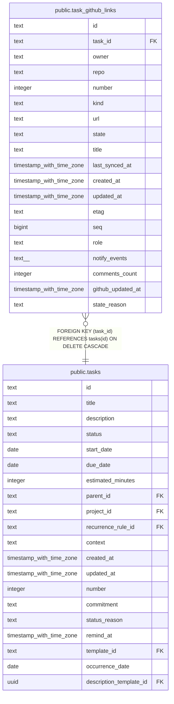

# public.task_github_links

## Description

GitHub issues and pull requests linked to tasks.

## Columns

| Name              | Type                     | Default | Nullable | Children | Parents                         | Comment                                                                                |
| ----------------- | ------------------------ | ------- | -------- | -------- | ------------------------------- | -------------------------------------------------------------------------------------- |
| id                | text                     |         | false    |          |                                 |                                                                                        |
| task_id           | text                     |         | false    |          | [public.tasks](public.tasks.md) | Task linked to this GitHub item.                                                       |
| owner             | text                     |         | false    |          |                                 | Owner of the repository containing this item.                                          |
| repo              | text                     |         | false    |          |                                 | Repository containing this item.                                                       |
| number            | integer                  |         | false    |          |                                 | GitHub issue or pull request number.                                                   |
| kind              | text                     |         | false    |          |                                 | GitHub item type: issue or pull_request.                                               |
| url               | text                     |         | false    |          |                                 | URL of the linked GitHub item.                                                         |
| state             | text                     |         | false    |          |                                 | Cached item state: open, closed, or merged.                                            |
| title             | text                     |         | false    |          |                                 | Cached title of the linked GitHub item.                                                |
| last_synced_at    | timestamp with time zone | now()   | false    |          |                                 | Time when the linked item's cached GitHub state was last synchronized.                 |
| created_at        | timestamp with time zone | now()   | false    |          |                                 |                                                                                        |
| updated_at        | timestamp with time zone | now()   | false    |          |                                 |                                                                                        |
| etag              | text                     |         | true     |          |                                 | ETag from the latest GitHub response, used for conditional synchronization.            |
| seq               | bigint                   |         | false    |          |                                 | Insertion-order sequence used to break ties between links created at the same time.    |
| role              | text                     |         | false    |          |                                 | Whether this item is the task subject or a GitHub blocker.                             |
| notify_events     | text[]                   |         | false    |          |                                 | GitHub change events selected for notifications: closed, reopened, comments, or other. |
| comments_count    | integer                  |         | true     |          |                                 | Cached number of comments on the linked GitHub item.                                   |
| github_updated_at | timestamp with time zone |         | true     |          |                                 | GitHub updated_at timestamp observed during the latest fetch.                          |
| state_reason      | text                     |         | true     |          |                                 | Cached GitHub reason for closing or reopening the item.                                |

## Constraints

| Name                                      | Type        | Definition                                                                                          |
| ----------------------------------------- | ----------- | --------------------------------------------------------------------------------------------------- |
| task_github_links_created_at_not_null     | n           | NOT NULL created_at                                                                                 |
| task_github_links_id_not_null             | n           | NOT NULL id                                                                                         |
| task_github_links_kind_not_null           | n           | NOT NULL kind                                                                                       |
| task_github_links_last_synced_at_not_null | n           | NOT NULL last_synced_at                                                                             |
| task_github_links_notify_events_check     | CHECK       | CHECK ((notify_events <@ ARRAY['closed'::text, 'reopened'::text, 'comments'::text, 'other'::text])) |
| task_github_links_notify_events_not_null  | n           | NOT NULL notify_events                                                                              |
| task_github_links_number_not_null         | n           | NOT NULL number                                                                                     |
| task_github_links_owner_not_null          | n           | NOT NULL owner                                                                                      |
| task_github_links_repo_not_null           | n           | NOT NULL repo                                                                                       |
| task_github_links_role_check              | CHECK       | CHECK ((role = ANY (ARRAY['subject'::text, 'blocker'::text])))                                      |
| task_github_links_role_not_null           | n           | NOT NULL role                                                                                       |
| task_github_links_seq_not_null            | n           | NOT NULL seq                                                                                        |
| task_github_links_state_kind_check        | CHECK       | CHECK (((kind = 'pull_request'::text) OR (state <> 'merged'::text)))                                |
| task_github_links_state_not_null          | n           | NOT NULL state                                                                                      |
| task_github_links_task_id_not_null        | n           | NOT NULL task_id                                                                                    |
| task_github_links_title_not_null          | n           | NOT NULL title                                                                                      |
| task_github_links_updated_at_not_null     | n           | NOT NULL updated_at                                                                                 |
| task_github_links_url_not_null            | n           | NOT NULL url                                                                                        |
| task_github_links_task_id_tasks_id_fk     | FOREIGN KEY | FOREIGN KEY (task_id) REFERENCES tasks(id) ON DELETE CASCADE                                        |
| task_github_links_pkey                    | PRIMARY KEY | PRIMARY KEY (id)                                                                                    |

## Indexes

| Name                                     | Definition                                                                                                                                                |
| ---------------------------------------- | --------------------------------------------------------------------------------------------------------------------------------------------------------- |
| task_github_links_pkey                   | CREATE UNIQUE INDEX task_github_links_pkey ON public.task_github_links USING btree (id)                                                                   |
| idx_task_github_links_task_id_created_at | CREATE INDEX idx_task_github_links_task_id_created_at ON public.task_github_links USING btree (task_id, created_at)                                       |
| uq_task_github_links_subject_repo_number | CREATE UNIQUE INDEX uq_task_github_links_subject_repo_number ON public.task_github_links USING btree (owner, repo, number) WHERE (role = 'subject'::text) |
| uq_task_github_links_task_repo_number    | CREATE UNIQUE INDEX uq_task_github_links_task_repo_number ON public.task_github_links USING btree (task_id, owner, repo, number)                          |

## Relations

---

> Generated by [tbls](https://github.com/k1LoW/tbls)
