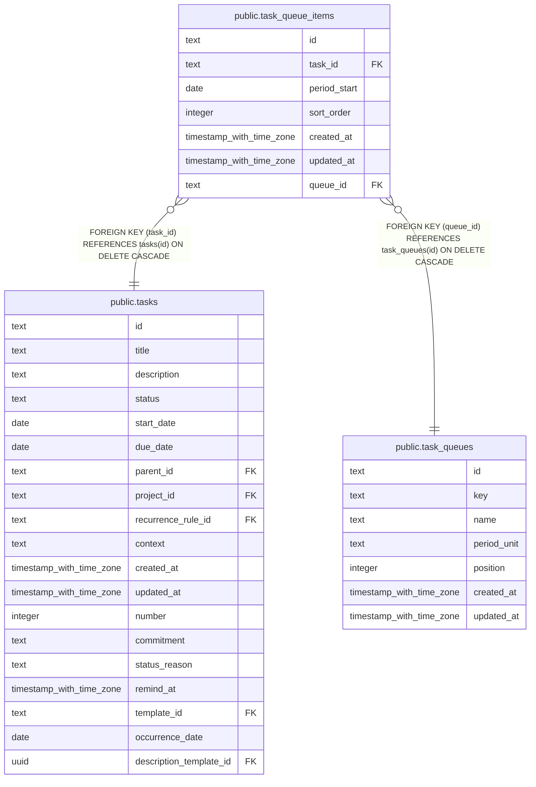

# public.task_queue_items

## Description

Tasks placed in a queue, optionally for a specific period.

## Columns

| Name         | Type                     | Default | Nullable | Children | Parents                                     | Comment                                                                                                                       |
| ------------ | ------------------------ | ------- | -------- | -------- | ------------------------------------------- | ----------------------------------------------------------------------------------------------------------------------------- |
| id           | text                     |         | false    |          |                                             |                                                                                                                               |
| task_id      | text                     |         | false    |          | [public.tasks](public.tasks.md)             | Task placed in the queue.                                                                                                     |
| period_start | date                     |         | true     |          |                                             | Period start date: the date for a daily queue, Monday for a weekly queue, or the first of the month; null for a static queue. |
| sort_order   | integer                  | 0       | false    |          |                                             | Position of the task within the queue period.                                                                                 |
| created_at   | timestamp with time zone | now()   | false    |          |                                             |                                                                                                                               |
| updated_at   | timestamp with time zone | now()   | false    |          |                                             |                                                                                                                               |
| queue_id     | text                     |         | false    |          | [public.task_queues](public.task_queues.md) | Queue containing the task.                                                                                                    |

## Constraints

| Name                                        | Type        | Definition                                                          |
| ------------------------------------------- | ----------- | ------------------------------------------------------------------- |
| task_queue_items_queue_id_not_null          | n           | NOT NULL queue_id                                                   |
| today_tasks_created_at_not_null             | n           | NOT NULL created_at                                                 |
| today_tasks_id_not_null                     | n           | NOT NULL id                                                         |
| today_tasks_sort_order_not_null             | n           | NOT NULL sort_order                                                 |
| today_tasks_task_id_not_null                | n           | NOT NULL task_id                                                    |
| today_tasks_updated_at_not_null             | n           | NOT NULL updated_at                                                 |
| task_queue_items_task_id_tasks_id_fk        | FOREIGN KEY | FOREIGN KEY (task_id) REFERENCES tasks(id) ON DELETE CASCADE        |
| task_queue_items_pkey                       | PRIMARY KEY | PRIMARY KEY (id)                                                    |
| task_queue_items_queue_id_task_queues_id_fk | FOREIGN KEY | FOREIGN KEY (queue_id) REFERENCES task_queues(id) ON DELETE CASCADE |
| task_queue_items_queue_period_task_unique   | UNIQUE      | UNIQUE NULLS NOT DISTINCT (queue_id, period_start, task_id)         |

## Indexes

| Name                                      | Definition                                                                                                                                                |
| ----------------------------------------- | --------------------------------------------------------------------------------------------------------------------------------------------------------- |
| task_queue_items_pkey                     | CREATE UNIQUE INDEX task_queue_items_pkey ON public.task_queue_items USING btree (id)                                                                     |
| task_queue_items_queue_period_task_unique | CREATE UNIQUE INDEX task_queue_items_queue_period_task_unique ON public.task_queue_items USING btree (queue_id, period_start, task_id) NULLS NOT DISTINCT |
| idx_task_queue_items_queue_period_sort    | CREATE INDEX idx_task_queue_items_queue_period_sort ON public.task_queue_items USING btree (queue_id, period_start, sort_order)                           |
| idx_task_queue_items_task_id              | CREATE INDEX idx_task_queue_items_task_id ON public.task_queue_items USING btree (task_id)                                                                |

## Relations

---

> Generated by [tbls](https://github.com/k1LoW/tbls)
