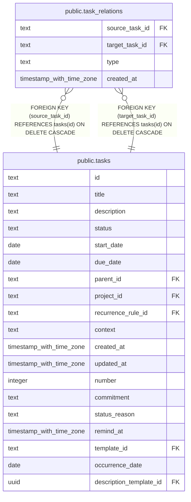

# public.task_relations

## Description

User-defined directed relationships between tasks.

## Columns

| Name           | Type                     | Default | Nullable | Children | Parents                         | Comment                                                                        |
| -------------- | ------------------------ | ------- | -------- | -------- | ------------------------------- | ------------------------------------------------------------------------------ |
| source_task_id | text                     |         | false    |          | [public.tasks](public.tasks.md) | Task whose relationship is described; read the relation from source to target. |
| target_task_id | text                     |         | false    |          | [public.tasks](public.tasks.md) | Task at the target end of the directed relationship.                           |
| type           | text                     |         | false    |          |                                 | Relation read as source type target: duplicate_of or blocked_by.               |
| created_at     | timestamp with time zone | now()   | false    |          |                                 |                                                                                |

## Constraints

| Name                                                 | Type        | Definition                                                          |
| ---------------------------------------------------- | ----------- | ------------------------------------------------------------------- |
| task_relations_created_at_not_null                   | n           | NOT NULL created_at                                                 |
| task_relations_no_self_relation                      | CHECK       | CHECK ((source_task_id <> target_task_id))                          |
| task_relations_source_task_id_not_null               | n           | NOT NULL source_task_id                                             |
| task_relations_target_task_id_not_null               | n           | NOT NULL target_task_id                                             |
| task_relations_type_not_null                         | n           | NOT NULL type                                                       |
| task_relations_source_task_id_tasks_id_fk            | FOREIGN KEY | FOREIGN KEY (source_task_id) REFERENCES tasks(id) ON DELETE CASCADE |
| task_relations_target_task_id_tasks_id_fk            | FOREIGN KEY | FOREIGN KEY (target_task_id) REFERENCES tasks(id) ON DELETE CASCADE |
| task_relations_source_task_id_target_task_id_type_pk | PRIMARY KEY | PRIMARY KEY (source_task_id, target_task_id, type)                  |

## Indexes

| Name                                                 | Definition                                                                                                                                           |
| ---------------------------------------------------- | ---------------------------------------------------------------------------------------------------------------------------------------------------- |
| task_relations_source_task_id_target_task_id_type_pk | CREATE UNIQUE INDEX task_relations_source_task_id_target_task_id_type_pk ON public.task_relations USING btree (source_task_id, target_task_id, type) |
| idx_task_relations_target_task_id_type               | CREATE INDEX idx_task_relations_target_task_id_type ON public.task_relations USING btree (target_task_id, type)                                      |

## Relations

---

> Generated by [tbls](https://github.com/k1LoW/tbls)
