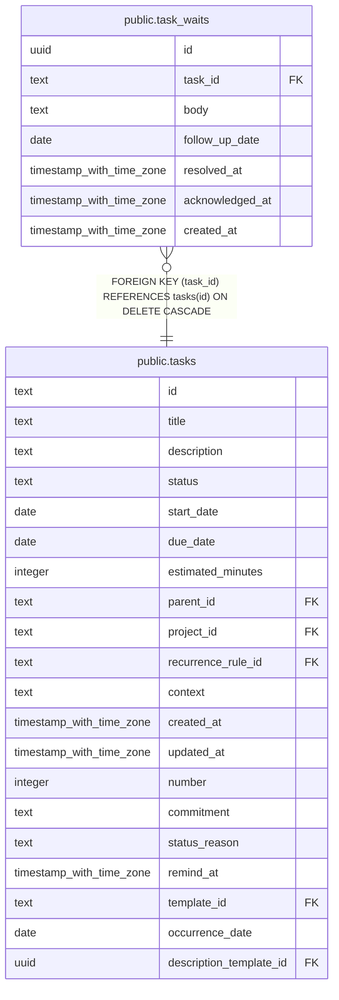

# public.task_waits

## Description

Response waits attached to tasks, including their resolution history.

## Columns

| Name            | Type                     | Default           | Nullable | Children | Parents                         | Comment                                                                  |
| --------------- | ------------------------ | ----------------- | -------- | -------- | ------------------------------- | ------------------------------------------------------------------------ |
| id              | uuid                     | gen_random_uuid() | false    |          |                                 |                                                                          |
| task_id         | text                     |                   | false    |          | [public.tasks](public.tasks.md) | Task waiting for a response.                                             |
| body            | text                     |                   | false    |          |                                 | Markdown describing the response or action the task is waiting for.      |
| follow_up_date  | date                     |                   | false    |          |                                 | Date to follow up when no response has arrived.                          |
| resolved_at     | timestamp with time zone |                   | true     |          |                                 | Time when the response wait was resolved; null while it blocks the task. |
| acknowledged_at | timestamp with time zone |                   | true     |          |                                 | Time when the resolution was acknowledged by the user.                   |
| created_at      | timestamp with time zone | now()             | false    |          |                                 |                                                                          |

## Constraints

| Name                                      | Type        | Definition                                                       |
| ----------------------------------------- | ----------- | ---------------------------------------------------------------- |
| task_waits_acknowledged_requires_resolved | CHECK       | CHECK (((acknowledged_at IS NULL) OR (resolved_at IS NOT NULL))) |
| task_waits_body_not_null                  | n           | NOT NULL body                                                    |
| task_waits_created_at_not_null            | n           | NOT NULL created_at                                              |
| task_waits_follow_up_date_not_null        | n           | NOT NULL follow_up_date                                          |
| task_waits_id_not_null                    | n           | NOT NULL id                                                      |
| task_waits_task_id_not_null               | n           | NOT NULL task_id                                                 |
| task_waits_task_id_tasks_id_fk            | FOREIGN KEY | FOREIGN KEY (task_id) REFERENCES tasks(id) ON DELETE CASCADE     |
| task_waits_pkey                           | PRIMARY KEY | PRIMARY KEY (id)                                                 |

## Indexes

| Name                   | Definition                                                                     |
| ---------------------- | ------------------------------------------------------------------------------ |
| task_waits_pkey        | CREATE UNIQUE INDEX task_waits_pkey ON public.task_waits USING btree (id)      |
| idx_task_waits_task_id | CREATE INDEX idx_task_waits_task_id ON public.task_waits USING btree (task_id) |

## Relations

---

> Generated by [tbls](https://github.com/k1LoW/tbls)
