# public.tasks

## Description

Tasks with optional parent, project, recurrence, and template relationships.

## Columns

| Name                    | Type                     | Default          | Nullable | Children                                                                                                                                                                                                                                                                                                                                                                                                                                                                                                                                                                                                                                                                                                | Parents                                                                   | Comment                                                                                                                                           |
| ----------------------- | ------------------------ | ---------------- | -------- | ------------------------------------------------------------------------------------------------------------------------------------------------------------------------------------------------------------------------------------------------------------------------------------------------------------------------------------------------------------------------------------------------------------------------------------------------------------------------------------------------------------------------------------------------------------------------------------------------------------------------------------------------------------------------------------------------------- | ------------------------------------------------------------------------- | ------------------------------------------------------------------------------------------------------------------------------------------------- |
| id                      | text                     |                  | false    | [public.task_comments](public.task_comments.md) [public.task_labels](public.task_labels.md) [public.task_pages](public.task_pages.md) [public.tasks](public.tasks.md) [public.time_blocks](public.time_blocks.md) [public.task_queue_items](public.task_queue_items.md) [public.edits](public.edits.md) [public.task_github_links](public.task_github_links.md) [public.task_links](public.task_links.md) [public.task_events](public.task_events.md) [public.task_agent_sessions](public.task_agent_sessions.md) [public.task_relations](public.task_relations.md) [public.recurring_task_templates](public.recurring_task_templates.md) [public.task_checklist_items](public.task_checklist_items.md) |                                                                           |                                                                                                                                                   |
| title                   | text                     |                  | false    |                                                                                                                                                                                                                                                                                                                                                                                                                                                                                                                                                                                                                                                                                                         |                                                                           | Human-readable task title.                                                                                                                        |
| description             | text                     |                  | true     |                                                                                                                                                                                                                                                                                                                                                                                                                                                                                                                                                                                                                                                                                                         |                                                                           | Optional task details.                                                                                                                            |
| status                  | text                     | 'todo'::text     | false    |                                                                                                                                                                                                                                                                                                                                                                                                                                                                                                                                                                                                                                                                                                         |                                                                           | Task status: todo or completed.                                                                                                                   |
| start_date              | date                     |                  | true     |                                                                                                                                                                                                                                                                                                                                                                                                                                                                                                                                                                                                                                                                                                         |                                                                           | Date when work on the task is planned to start.                                                                                                   |
| due_date                | date                     |                  | true     |                                                                                                                                                                                                                                                                                                                                                                                                                                                                                                                                                                                                                                                                                                         |                                                                           | Task deadline date.                                                                                                                               |
| estimated_minutes       | integer                  |                  | true     |                                                                                                                                                                                                                                                                                                                                                                                                                                                                                                                                                                                                                                                                                                         |                                                                           | Estimated task effort, in minutes.                                                                                                                |
| parent_id               | text                     |                  | true     |                                                                                                                                                                                                                                                                                                                                                                                                                                                                                                                                                                                                                                                                                                         | [public.tasks](public.tasks.md)                                           | Parent task in the task hierarchy.                                                                                                                |
| project_id              | text                     |                  | true     |                                                                                                                                                                                                                                                                                                                                                                                                                                                                                                                                                                                                                                                                                                         | [public.projects](public.projects.md)                                     | Project associated with the task.                                                                                                                 |
| recurrence_rule_id      | text                     |                  | true     |                                                                                                                                                                                                                                                                                                                                                                                                                                                                                                                                                                                                                                                                                                         | [public.recurrence_rules](public.recurrence_rules.md)                     | Recurrence rule associated with the task.                                                                                                         |
| context                 | text                     | 'personal'::text | false    |                                                                                                                                                                                                                                                                                                                                                                                                                                                                                                                                                                                                                                                                                                         |                                                                           | Whether the task belongs to the work or personal context.                                                                                         |
| created_at              | timestamp with time zone | now()            | false    |                                                                                                                                                                                                                                                                                                                                                                                                                                                                                                                                                                                                                                                                                                         |                                                                           |                                                                                                                                                   |
| updated_at              | timestamp with time zone | now()            | false    |                                                                                                                                                                                                                                                                                                                                                                                                                                                                                                                                                                                                                                                                                                         |                                                                           |                                                                                                                                                   |
| number                  | integer                  |                  | false    |                                                                                                                                                                                                                                                                                                                                                                                                                                                                                                                                                                                                                                                                                                         |                                                                           | Globally unique, human-facing sequential task number.                                                                                             |
| commitment              | text                     | 'inbox'::text    | false    |                                                                                                                                                                                                                                                                                                                                                                                                                                                                                                                                                                                                                                                                                                         |                                                                           | Triage state: inbox for untriaged, active for committed, or someday for deferred.                                                                 |
| status_reason           | text                     |                  | true     |                                                                                                                                                                                                                                                                                                                                                                                                                                                                                                                                                                                                                                                                                                         |                                                                           | Reason for the completed status: completed, not_planned, or duplicate.                                                                            |
| remind_at               | timestamp with time zone |                  | true     |                                                                                                                                                                                                                                                                                                                                                                                                                                                                                                                                                                                                                                                                                                         |                                                                           | Time when a reminder is due; cleared when claimed for delivery.                                                                                   |
| template_id             | text                     |                  | true     |                                                                                                                                                                                                                                                                                                                                                                                                                                                                                                                                                                                                                                                                                                         | [public.recurring_task_templates](public.recurring_task_templates.md)     | Recurring task template that generated this task; null for tasks created independently.                                                           |
| occurrence_date         | date                     |                  | true     |                                                                                                                                                                                                                                                                                                                                                                                                                                                                                                                                                                                                                                                                                                         |                                                                           | Date represented by this generated task occurrence; set together with template_id.                                                                |
| description_template_id | uuid                     |                  | true     |                                                                                                                                                                                                                                                                                                                                                                                                                                                                                                                                                                                                                                                                                                         | [public.task_description_templates](public.task_description_templates.md) | Description template that validated an LLM-authored task; null if no template was used, the task was human-authored, or the template was deleted. |

## Constraints

| Name                                                           | Type        | Definition                                                                                         |
| -------------------------------------------------------------- | ----------- | -------------------------------------------------------------------------------------------------- |
| tasks_commitment_not_null                                      | n           | NOT NULL commitment                                                                                |
| tasks_context_not_null                                         | n           | NOT NULL context                                                                                   |
| tasks_created_at_not_null                                      | n           | NOT NULL created_at                                                                                |
| tasks_id_not_null                                              | n           | NOT NULL id                                                                                        |
| tasks_number_not_null                                          | n           | NOT NULL number                                                                                    |
| tasks_status_not_null                                          | n           | NOT NULL status                                                                                    |
| tasks_status_reason_check                                      | CHECK       | CHECK (((status = 'completed'::text) OR (status_reason IS NULL)))                                  |
| tasks_template_occurrence_paired_check                         | CHECK       | CHECK (((template_id IS NULL) = (occurrence_date IS NULL)))                                        |
| tasks_title_not_null                                           | n           | NOT NULL title                                                                                     |
| tasks_updated_at_not_null                                      | n           | NOT NULL updated_at                                                                                |
| tasks_project_id_projects_id_fk                                | FOREIGN KEY | FOREIGN KEY (project_id) REFERENCES projects(id) ON DELETE SET NULL                                |
| tasks_recurrence_rule_id_recurrence_rules_id_fk                | FOREIGN KEY | FOREIGN KEY (recurrence_rule_id) REFERENCES recurrence_rules(id) ON DELETE SET NULL                |
| tasks_parent_id_tasks_id_fk                                    | FOREIGN KEY | FOREIGN KEY (parent_id) REFERENCES tasks(id) ON DELETE SET NULL                                    |
| tasks_pkey                                                     | PRIMARY KEY | PRIMARY KEY (id)                                                                                   |
| tasks_number_unique                                            | UNIQUE      | UNIQUE (number)                                                                                    |
| tasks_template_id_recurring_task_templates_id_fk               | FOREIGN KEY | FOREIGN KEY (template_id) REFERENCES recurring_task_templates(id) ON DELETE SET NULL               |
| tasks_description_template_id_task_description_templates_id_fk | FOREIGN KEY | FOREIGN KEY (description_template_id) REFERENCES task_description_templates(id) ON DELETE SET NULL |

## Indexes

| Name                                     | Definition                                                                                                                                              |
| ---------------------------------------- | ------------------------------------------------------------------------------------------------------------------------------------------------------- |
| tasks_pkey                               | CREATE UNIQUE INDEX tasks_pkey ON public.tasks USING btree (id)                                                                                         |
| idx_tasks_parent_id                      | CREATE INDEX idx_tasks_parent_id ON public.tasks USING btree (parent_id)                                                                                |
| idx_tasks_status                         | CREATE INDEX idx_tasks_status ON public.tasks USING btree (status)                                                                                      |
| idx_tasks_start_date                     | CREATE INDEX idx_tasks_start_date ON public.tasks USING btree (start_date)                                                                              |
| idx_tasks_due_date                       | CREATE INDEX idx_tasks_due_date ON public.tasks USING btree (due_date)                                                                                  |
| idx_tasks_project_id                     | CREATE INDEX idx_tasks_project_id ON public.tasks USING btree (project_id)                                                                              |
| idx_tasks_project_status                 | CREATE INDEX idx_tasks_project_status ON public.tasks USING btree (project_id, status)                                                                  |
| tasks_number_unique                      | CREATE UNIQUE INDEX tasks_number_unique ON public.tasks USING btree (number)                                                                            |
| idx_tasks_commitment                     | CREATE INDEX idx_tasks_commitment ON public.tasks USING btree (commitment)                                                                              |
| idx_tasks_remind_at                      | CREATE INDEX idx_tasks_remind_at ON public.tasks USING btree (remind_at) WHERE (remind_at IS NOT NULL)                                                  |
| idx_tasks_template_id                    | CREATE INDEX idx_tasks_template_id ON public.tasks USING btree (template_id)                                                                            |
| tasks_template_id_occurrence_date_unique | CREATE UNIQUE INDEX tasks_template_id_occurrence_date_unique ON public.tasks USING btree (template_id, occurrence_date) WHERE (template_id IS NOT NULL) |
| idx_tasks_title_trgm                     | CREATE INDEX idx_tasks_title_trgm ON public.tasks USING gin (title gin_trgm_ops)                                                                        |
| idx_tasks_description_trgm               | CREATE INDEX idx_tasks_description_trgm ON public.tasks USING gin (description gin_trgm_ops)                                                            |
| idx_tasks_description_template_id        | CREATE INDEX idx_tasks_description_template_id ON public.tasks USING btree (description_template_id) WHERE (description_template_id IS NOT NULL)        |

## Relations

```mermaid
erDiagram

"public.task_comments" }o--|| "public.tasks" : "FOREIGN KEY (task_id) REFERENCES tasks(id) ON DELETE CASCADE"
"public.task_labels" }o--|| "public.tasks" : "FOREIGN KEY (task_id) REFERENCES tasks(id) ON DELETE CASCADE"
"public.task_pages" }o--|| "public.tasks" : "FOREIGN KEY (task_id) REFERENCES tasks(id) ON DELETE CASCADE"
"public.tasks" }o--o| "public.tasks" : "FOREIGN KEY (parent_id) REFERENCES tasks(id) ON DELETE SET NULL"
"public.time_blocks" }o--|| "public.tasks" : "FOREIGN KEY (task_id) REFERENCES tasks(id) ON DELETE CASCADE"
"public.task_queue_items" }o--|| "public.tasks" : "FOREIGN KEY (task_id) REFERENCES tasks(id) ON DELETE CASCADE"
"public.edits" }o--|| "public.tasks" : "FOREIGN KEY (task_id) REFERENCES tasks(id) ON DELETE CASCADE"
"public.task_github_links" }o--|| "public.tasks" : "FOREIGN KEY (task_id) REFERENCES tasks(id) ON DELETE CASCADE"
"public.task_links" }o--|| "public.tasks" : "FOREIGN KEY (source_task_id) REFERENCES tasks(id) ON DELETE CASCADE"
"public.task_links" }o--|| "public.tasks" : "FOREIGN KEY (target_task_id) REFERENCES tasks(id) ON DELETE CASCADE"
"public.task_events" }o--|| "public.tasks" : "FOREIGN KEY (task_id) REFERENCES tasks(id) ON DELETE CASCADE"
"public.task_agent_sessions" }o--|| "public.tasks" : "FOREIGN KEY (task_id) REFERENCES tasks(id) ON DELETE CASCADE"
"public.task_checklist_items" }o--o| "public.tasks" : "FOREIGN KEY (subtask_id) REFERENCES tasks(id) ON DELETE SET NULL"
"public.task_relations" }o--|| "public.tasks" : "FOREIGN KEY (source_task_id) REFERENCES tasks(id) ON DELETE CASCADE"
"public.task_relations" }o--|| "public.tasks" : "FOREIGN KEY (target_task_id) REFERENCES tasks(id) ON DELETE CASCADE"
"public.recurring_task_templates" }o--o| "public.tasks" : "FOREIGN KEY (parent_id) REFERENCES tasks(id) ON DELETE SET NULL"
"public.tasks" }o--o| "public.projects" : "FOREIGN KEY (project_id) REFERENCES projects(id) ON DELETE SET NULL"
"public.tasks" }o--o| "public.recurrence_rules" : "FOREIGN KEY (recurrence_rule_id) REFERENCES recurrence_rules(id) ON DELETE SET NULL"
"public.tasks" }o--o| "public.recurring_task_templates" : "FOREIGN KEY (template_id) REFERENCES recurring_task_templates(id) ON DELETE SET NULL"
"public.tasks" }o--o| "public.task_description_templates" : "FOREIGN KEY (description_template_id) REFERENCES task_description_templates(id) ON DELETE SET NULL"

"public.tasks" {
  text id
  text title
  text description
  text status
  date start_date
  date due_date
  integer estimated_minutes
  text parent_id FK
  text project_id FK
  text recurrence_rule_id FK
  text context
  timestamp_with_time_zone created_at
  timestamp_with_time_zone updated_at
  integer number
  text commitment
  text status_reason
  timestamp_with_time_zone remind_at
  text template_id FK
  date occurrence_date
  uuid description_template_id FK
}
"public.task_comments" {
  text id
  text task_id FK
  text content
  timestamp_with_time_zone created_at
  timestamp_with_time_zone updated_at
}
"public.task_labels" {
  text task_id FK
  text label_id FK
}
"public.task_pages" {
  text id
  text task_id FK
  text title
  text content
  integer sort_order
  timestamp_with_time_zone created_at
  timestamp_with_time_zone updated_at
  text format
}
"public.time_blocks" {
  text id
  text task_id FK
  timestamp_with_time_zone start_time
  timestamp_with_time_zone end_time
  boolean is_auto_scheduled
  timestamp_with_time_zone created_at
  timestamp_with_time_zone updated_at
}
"public.task_queue_items" {
  text id
  text task_id FK
  date period_start
  integer sort_order
  timestamp_with_time_zone created_at
  timestamp_with_time_zone updated_at
  text queue_id FK
}
"public.edits" {
  bigint id
  text task_id FK
  text page_id FK
  text comment_id FK
  text action
  text field
  text author_kind
  text author_agent
  timestamp_with_time_zone created_at
  timestamp_with_time_zone updated_at
}
"public.task_github_links" {
  text id
  text task_id FK
  text owner
  text repo
  integer number
  text kind
  text url
  text state
  text title
  timestamp_with_time_zone last_synced_at
  timestamp_with_time_zone created_at
  timestamp_with_time_zone updated_at
  text etag
  bigint seq
  text role
  text__ notify_events
  integer comments_count
  timestamp_with_time_zone github_updated_at
  text state_reason
}
"public.task_links" {
  text source_task_id FK
  text target_task_id FK
  timestamp_with_time_zone created_at
}
"public.task_events" {
  bigint id
  text task_id FK
  text type
  text from_status
  text to_status
  text github_owner
  text github_repo
  integer github_number
  text github_kind
  text author_kind
  text author_agent
  timestamp_with_time_zone created_at
  text to_status_reason
}
"public.task_agent_sessions" {
  text task_id FK
  text agent_session_id FK
  timestamp_with_time_zone linked_at
}
"public.task_relations" {
  text source_task_id FK
  text target_task_id FK
  text type
  timestamp_with_time_zone created_at
}
"public.recurring_task_templates" {
  text id
  text title
  text description
  integer estimated_minutes
  text project_id FK
  text parent_id FK
  text context
  text recurrence_rule_id FK
  integer start_offset_days
  date anchor_date
  date last_generated_date
  boolean enabled
  timestamp_with_time_zone created_at
  timestamp_with_time_zone updated_at
}
"public.projects" {
  text id
  text title
  text description
  text status
  date start_date
  date target_date
  text color
  integer sort_order
  timestamp_with_time_zone created_at
  timestamp_with_time_zone updated_at
  text context
}
"public.recurrence_rules" {
  text id
  text type
  integer interval
  integer__ days_of_week
  integer day_of_month
  timestamp_with_time_zone created_at
  timestamp_with_time_zone updated_at
}
"public.task_description_templates" {
  uuid id
  text name
  text when_to_use
  text body
  text guide
  boolean is_default
  timestamp_with_time_zone created_at
  timestamp_with_time_zone updated_at
}
"public.task_checklist_items" {
  text id
  text checklist_id FK
  text parent_item_id FK
  text content
  text note
  timestamp_with_time_zone checked_at
  integer sort_order
  text github_link_id FK
  text subtask_id FK
  timestamp_with_time_zone created_at
  timestamp_with_time_zone updated_at
}
```

---

> Generated by [tbls](https://github.com/k1LoW/tbls)
