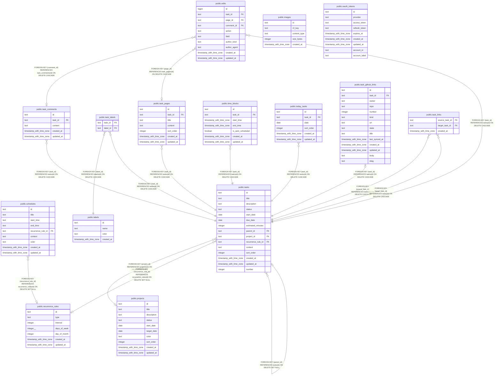

# tq_test

## Tables

| Name                                                    | Columns | Comment | Type       |
| ------------------------------------------------------- | ------- | ------- | ---------- |
| [public.images](public.images.md)                       | 5       |         | BASE TABLE |
| [public.labels](public.labels.md)                       | 4       |         | BASE TABLE |
| [public.oauth_tokens](public.oauth_tokens.md)           | 9       |         | BASE TABLE |
| [public.projects](public.projects.md)                   | 10      |         | BASE TABLE |
| [public.recurrence_rules](public.recurrence_rules.md)   | 7       |         | BASE TABLE |
| [public.schedules](public.schedules.md)                 | 9       |         | BASE TABLE |
| [public.task_comments](public.task_comments.md)         | 5       |         | BASE TABLE |
| [public.task_labels](public.task_labels.md)             | 2       |         | BASE TABLE |
| [public.task_pages](public.task_pages.md)               | 7       |         | BASE TABLE |
| [public.tasks](public.tasks.md)                         | 15      |         | BASE TABLE |
| [public.time_blocks](public.time_blocks.md)             | 7       |         | BASE TABLE |
| [public.today_tasks](public.today_tasks.md)             | 6       |         | BASE TABLE |
| [public.edits](public.edits.md)                         | 10      |         | BASE TABLE |
| [public.task_github_links](public.task_github_links.md) | 14      |         | BASE TABLE |
| [public.task_links](public.task_links.md)               | 3       |         | BASE TABLE |

## Relations

---

> Generated by [tbls](https://github.com/k1LoW/tbls)
