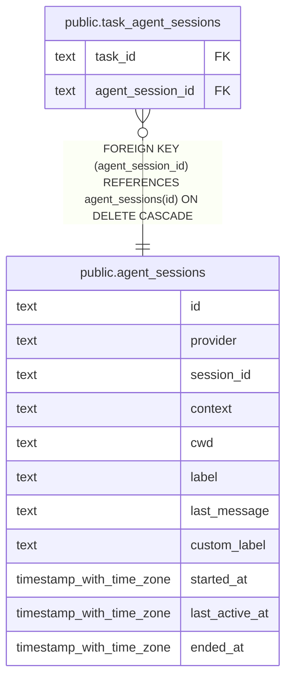

# public.agent_sessions

## Columns

| Name           | Type                     | Default          | Nullable | Children                                                    | Parents | Comment |
| -------------- | ------------------------ | ---------------- | -------- | ----------------------------------------------------------- | ------- | ------- |
| id             | text                     |                  | false    | [public.task_agent_sessions](public.task_agent_sessions.md) |         |         |
| provider       | text                     |                  | false    |                                                             |         |         |
| session_id     | text                     |                  | false    |                                                             |         |         |
| context        | text                     | 'personal'::text | false    |                                                             |         |         |
| cwd            | text                     |                  | false    |                                                             |         |         |
| label          | text                     |                  | true     |                                                             |         |         |
| last_message   | text                     |                  | true     |                                                             |         |         |
| custom_label   | text                     |                  | true     |                                                             |         |         |
| started_at     | timestamp with time zone | now()            | false    |                                                             |         |         |
| last_active_at | timestamp with time zone | now()            | false    |                                                             |         |         |
| ended_at       | timestamp with time zone |                  | true     |                                                             |         |         |

## Constraints

| Name                                  | Type        | Definition                    |
| ------------------------------------- | ----------- | ----------------------------- |
| agent_sessions_pkey                   | PRIMARY KEY | PRIMARY KEY (id)              |
| uq_agent_sessions_provider_session_id | UNIQUE      | UNIQUE (provider, session_id) |

## Indexes

| Name                                  | Definition                                                                                                            |
| ------------------------------------- | --------------------------------------------------------------------------------------------------------------------- |
| agent_sessions_pkey                   | CREATE UNIQUE INDEX agent_sessions_pkey ON public.agent_sessions USING btree (id)                                     |
| uq_agent_sessions_provider_session_id | CREATE UNIQUE INDEX uq_agent_sessions_provider_session_id ON public.agent_sessions USING btree (provider, session_id) |
| idx_agent_sessions_last_active_at     | CREATE INDEX idx_agent_sessions_last_active_at ON public.agent_sessions USING btree (last_active_at)                  |

## Relations

---

> Generated by [tbls](https://github.com/k1LoW/tbls)
