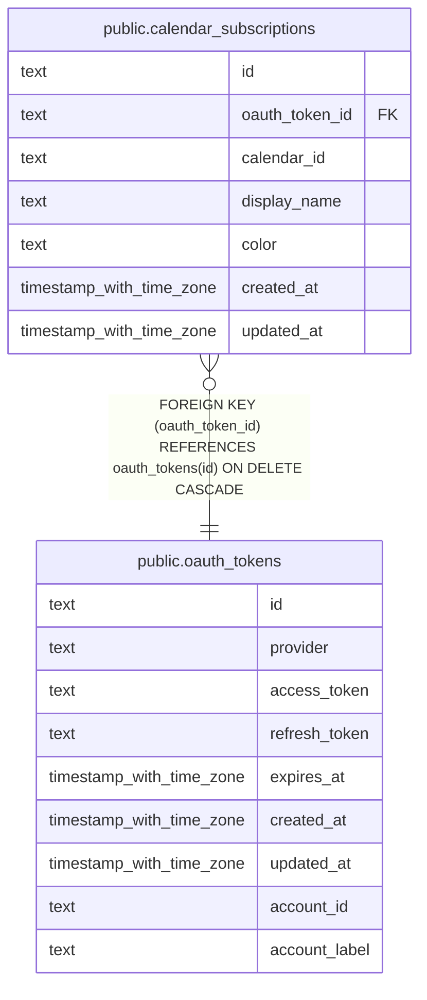

# public.calendar_subscriptions

## Columns

| Name           | Type                     | Default | Nullable | Children | Parents                                       | Comment |
| -------------- | ------------------------ | ------- | -------- | -------- | --------------------------------------------- | ------- |
| id             | text                     |         | false    |          |                                               |         |
| oauth_token_id | text                     |         | false    |          | [public.oauth_tokens](public.oauth_tokens.md) |         |
| calendar_id    | text                     |         | false    |          |                                               |         |
| display_name   | text                     |         | true     |          |                                               |         |
| color          | text                     |         | true     |          |                                               |         |
| created_at     | timestamp with time zone | now()   | false    |          |                                               |         |
| updated_at     | timestamp with time zone | now()   | false    |          |                                               |         |

## Constraints

| Name                                                     | Type        | Definition                                                                 |
| -------------------------------------------------------- | ----------- | -------------------------------------------------------------------------- |
| calendar_subscriptions_oauth_token_id_oauth_tokens_id_fk | FOREIGN KEY | FOREIGN KEY (oauth_token_id) REFERENCES oauth_tokens(id) ON DELETE CASCADE |
| calendar_subscriptions_pkey                              | PRIMARY KEY | PRIMARY KEY (id)                                                           |
| uq_calendar_subscriptions_oauth_token_calendar           | UNIQUE      | UNIQUE (oauth_token_id, calendar_id)                                       |

## Indexes

| Name                                           | Definition                                                                                                                                    |
| ---------------------------------------------- | --------------------------------------------------------------------------------------------------------------------------------------------- |
| calendar_subscriptions_pkey                    | CREATE UNIQUE INDEX calendar_subscriptions_pkey ON public.calendar_subscriptions USING btree (id)                                             |
| uq_calendar_subscriptions_oauth_token_calendar | CREATE UNIQUE INDEX uq_calendar_subscriptions_oauth_token_calendar ON public.calendar_subscriptions USING btree (oauth_token_id, calendar_id) |

## Relations

---

> Generated by [tbls](https://github.com/k1LoW/tbls)
