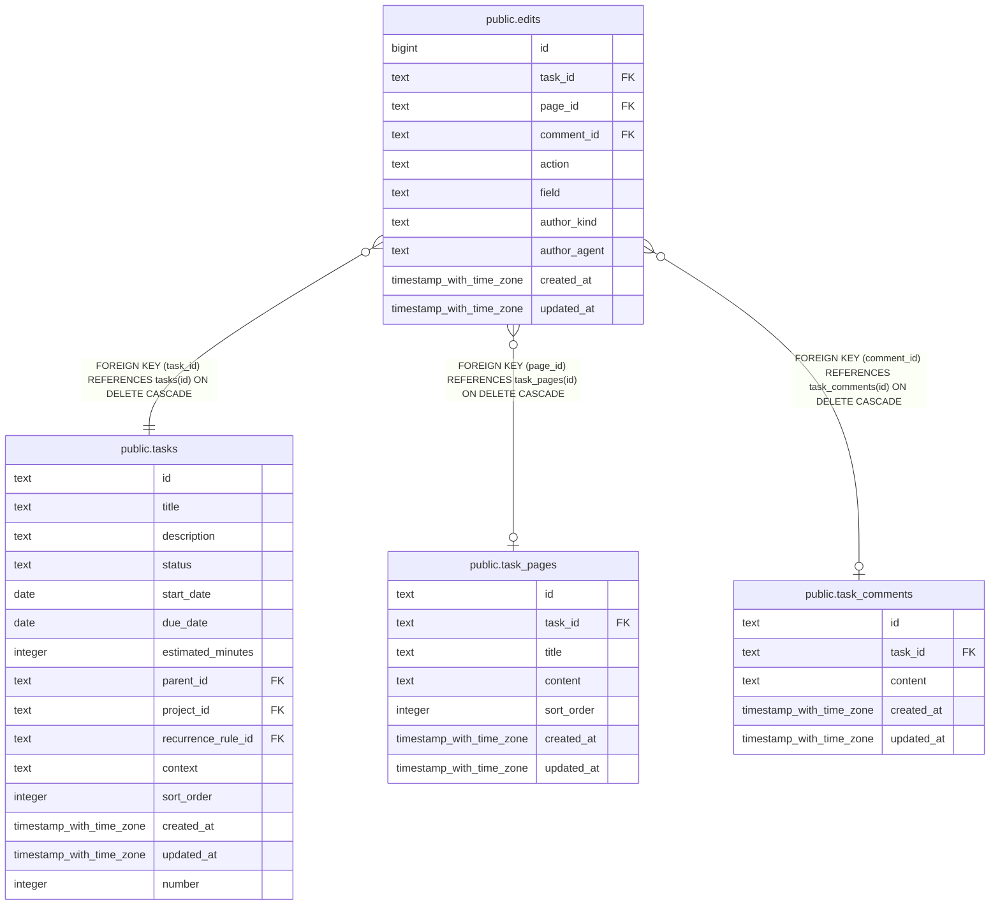

# public.edits

## Columns

| Name | Type | Default | Nullable | Children | Parents | Comment |
| ---- | ---- | ------- | -------- | -------- | ------- | ------- |
| id | bigint |  | false |  |  |  |
| task_id | text |  | false |  | [public.tasks](public.tasks.md) |  |
| page_id | text |  | true |  | [public.task_pages](public.task_pages.md) |  |
| comment_id | text |  | true |  | [public.task_comments](public.task_comments.md) |  |
| action | text |  | false |  |  |  |
| field | text |  | true |  |  |  |
| author_kind | text |  | false |  |  |  |
| author_agent | text |  | true |  |  |  |
| created_at | timestamp with time zone | now() | false |  |  |  |
| updated_at | timestamp with time zone | now() | false |  |  |  |

## Constraints

| Name | Type | Definition |
| ---- | ---- | ---------- |
| edits_action_check | CHECK | CHECK ((action = ANY (ARRAY['create'::text, 'update'::text]))) |
| edits_action_field_check | CHECK | CHECK ((((action = 'create'::text) AND (field IS NULL)) OR ((action = 'update'::text) AND (field IS NOT NULL)))) |
| edits_author_agent_required_for_llm | CHECK | CHECK (((author_kind = 'llm'::text) = (author_agent IS NOT NULL))) |
| edits_author_kind_check | CHECK | CHECK ((author_kind = ANY (ARRAY['human'::text, 'llm'::text, 'system'::text]))) |
| edits_field_target_check | CHECK | CHECK (((field IS NULL) OR ((page_id IS NULL) AND (comment_id IS NULL) AND (field = ANY (ARRAY['title'::text, 'description'::text]))) OR ((page_id IS NOT NULL) AND (field = ANY (ARRAY['title'::text, 'content'::text]))) OR ((comment_id IS NOT NULL) AND (field = 'content'::text)))) |
| edits_target_exclusive_check | CHECK | CHECK ((NOT ((page_id IS NOT NULL) AND (comment_id IS NOT NULL)))) |
| edits_comment_id_task_comments_id_fk | FOREIGN KEY | FOREIGN KEY (comment_id) REFERENCES task_comments(id) ON DELETE CASCADE |
| edits_page_id_task_pages_id_fk | FOREIGN KEY | FOREIGN KEY (page_id) REFERENCES task_pages(id) ON DELETE CASCADE |
| edits_task_id_tasks_id_fk | FOREIGN KEY | FOREIGN KEY (task_id) REFERENCES tasks(id) ON DELETE CASCADE |
| edits_pkey | PRIMARY KEY | PRIMARY KEY (id) |

## Indexes

| Name | Definition |
| ---- | ---------- |
| edits_pkey | CREATE UNIQUE INDEX edits_pkey ON public.edits USING btree (id) |
| idx_edits_task_id_created_at | CREATE INDEX idx_edits_task_id_created_at ON public.edits USING btree (task_id, created_at) |
| idx_edits_page_id | CREATE INDEX idx_edits_page_id ON public.edits USING btree (page_id) WHERE (page_id IS NOT NULL) |
| idx_edits_comment_id | CREATE INDEX idx_edits_comment_id ON public.edits USING btree (comment_id) WHERE (comment_id IS NOT NULL) |

## Relations

---

> Generated by [tbls](https://github.com/k1LoW/tbls)
