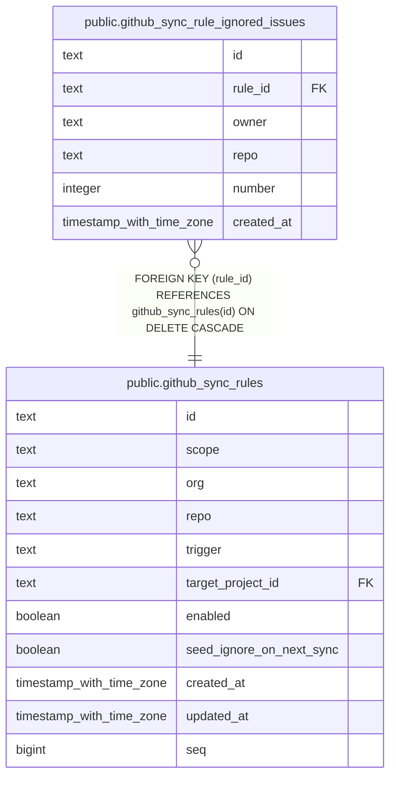

# public.github_sync_rule_ignored_issues

## Columns

| Name       | Type                     | Default | Nullable | Children | Parents                                                 | Comment |
| ---------- | ------------------------ | ------- | -------- | -------- | ------------------------------------------------------- | ------- |
| id         | text                     |         | false    |          |                                                         |         |
| rule_id    | text                     |         | false    |          | [public.github_sync_rules](public.github_sync_rules.md) |         |
| owner      | text                     |         | false    |          |                                                         |         |
| repo       | text                     |         | false    |          |                                                         |         |
| number     | integer                  |         | false    |          |                                                         |         |
| created_at | timestamp with time zone | now()   | false    |          |                                                         |         |

## Constraints

| Name                                                            | Type        | Definition                                                               |
| --------------------------------------------------------------- | ----------- | ------------------------------------------------------------------------ |
| github_sync_rule_ignored_issues_pkey                            | PRIMARY KEY | PRIMARY KEY (id)                                                         |
| uq_github_sync_rule_ignored_issues                              | UNIQUE      | UNIQUE (rule_id, owner, repo, number)                                    |
| github_sync_rule_ignored_issues_rule_id_github_sync_rules_id_fk | FOREIGN KEY | FOREIGN KEY (rule_id) REFERENCES github_sync_rules(id) ON DELETE CASCADE |

## Indexes

| Name                                 | Definition                                                                                                                                  |
| ------------------------------------ | ------------------------------------------------------------------------------------------------------------------------------------------- |
| github_sync_rule_ignored_issues_pkey | CREATE UNIQUE INDEX github_sync_rule_ignored_issues_pkey ON public.github_sync_rule_ignored_issues USING btree (id)                         |
| uq_github_sync_rule_ignored_issues   | CREATE UNIQUE INDEX uq_github_sync_rule_ignored_issues ON public.github_sync_rule_ignored_issues USING btree (rule_id, owner, repo, number) |

## Relations

---

> Generated by [tbls](https://github.com/k1LoW/tbls)
