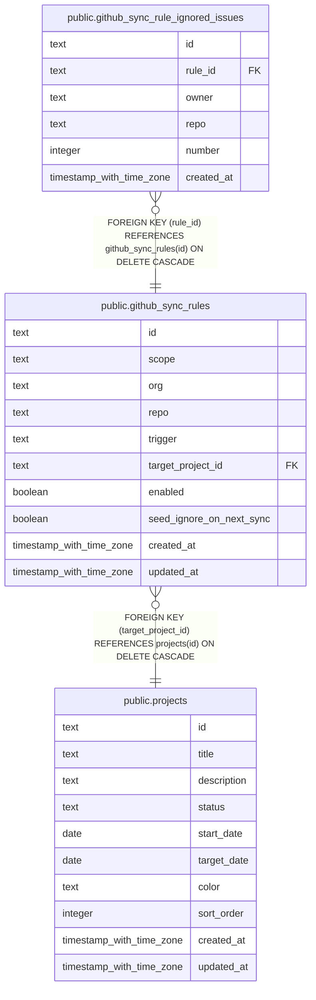

# public.github_sync_rules

## Columns

| Name | Type | Default | Nullable | Children | Parents | Comment |
| ---- | ---- | ------- | -------- | -------- | ------- | ------- |
| id | text |  | false | [public.github_sync_rule_ignored_issues](public.github_sync_rule_ignored_issues.md) |  |  |
| scope | text |  | false |  |  |  |
| org | text |  | true |  |  |  |
| repo | text |  | true |  |  |  |
| trigger | text | 'assigned'::text | false |  |  |  |
| target_project_id | text |  | false |  | [public.projects](public.projects.md) |  |
| enabled | boolean | true | false |  |  |  |
| seed_ignore_on_next_sync | boolean | false | false |  |  |  |
| created_at | timestamp with time zone | now() | false |  |  |  |
| updated_at | timestamp with time zone | now() | false |  |  |  |

## Constraints

| Name | Type | Definition |
| ---- | ---- | ---------- |
| github_sync_rules_scope_target_check | CHECK | CHECK ((((scope = 'all'::text) AND (org IS NULL) AND (repo IS NULL)) OR ((scope = 'org'::text) AND (org IS NOT NULL) AND (repo IS NULL)) OR ((scope = 'repo'::text) AND (org IS NOT NULL) AND (repo IS NOT NULL)))) |
| github_sync_rules_target_project_id_projects_id_fk | FOREIGN KEY | FOREIGN KEY (target_project_id) REFERENCES projects(id) ON DELETE CASCADE |
| github_sync_rules_pkey | PRIMARY KEY | PRIMARY KEY (id) |

## Indexes

| Name | Definition |
| ---- | ---------- |
| github_sync_rules_pkey | CREATE UNIQUE INDEX github_sync_rules_pkey ON public.github_sync_rules USING btree (id) |
| idx_github_sync_rules_enabled | CREATE INDEX idx_github_sync_rules_enabled ON public.github_sync_rules USING btree (enabled) |
| idx_github_sync_rules_target_project_id | CREATE INDEX idx_github_sync_rules_target_project_id ON public.github_sync_rules USING btree (target_project_id) |

## Relations

---

> Generated by [tbls](https://github.com/k1LoW/tbls)
