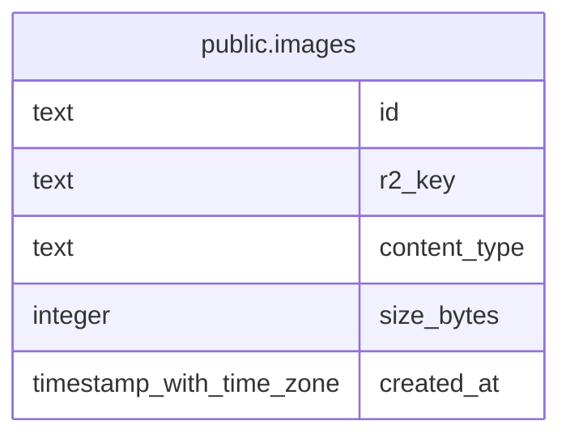

# public.images

## Columns

| Name         | Type                     | Default | Nullable | Children | Parents | Comment |
| ------------ | ------------------------ | ------- | -------- | -------- | ------- | ------- |
| id           | text                     |         | false    |          |         |         |
| r2_key       | text                     |         | false    |          |         |         |
| content_type | text                     |         | false    |          |         |         |
| size_bytes   | integer                  |         | false    |          |         |         |
| created_at   | timestamp with time zone | now()   | false    |          |         |         |

## Constraints

| Name                 | Type        | Definition       |
| -------------------- | ----------- | ---------------- |
| images_pkey          | PRIMARY KEY | PRIMARY KEY (id) |
| images_r2_key_unique | UNIQUE      | UNIQUE (r2_key)  |

## Indexes

| Name                 | Definition                                                                     |
| -------------------- | ------------------------------------------------------------------------------ |
| images_pkey          | CREATE UNIQUE INDEX images_pkey ON public.images USING btree (id)              |
| images_r2_key_unique | CREATE UNIQUE INDEX images_r2_key_unique ON public.images USING btree (r2_key) |
| idx_images_r2_key    | CREATE INDEX idx_images_r2_key ON public.images USING btree (r2_key)           |

## Relations

---

> Generated by [tbls](https://github.com/k1LoW/tbls)
