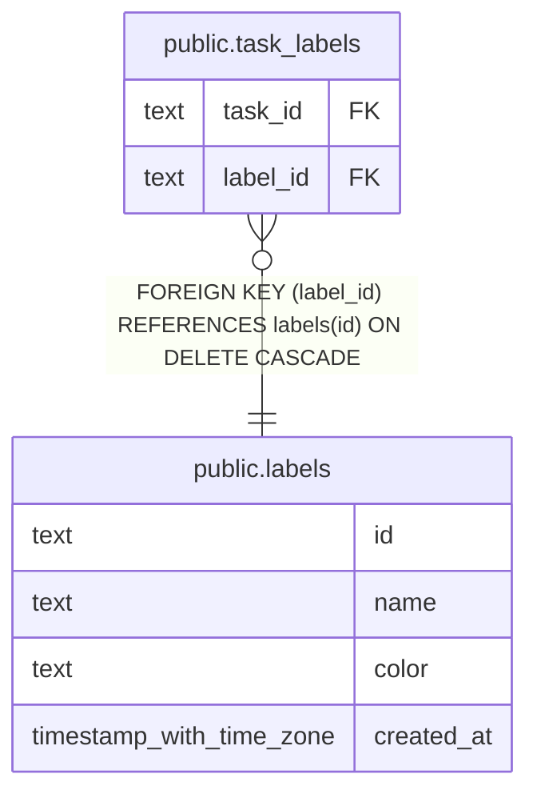

# public.labels

## Columns

| Name | Type | Default | Nullable | Children | Parents | Comment |
| ---- | ---- | ------- | -------- | -------- | ------- | ------- |
| id | text |  | false | [public.task_labels](public.task_labels.md) |  |  |
| name | text |  | false |  |  |  |
| color | text |  | true |  |  |  |
| created_at | timestamp with time zone | now() | false |  |  |  |

## Constraints

| Name | Type | Definition |
| ---- | ---- | ---------- |
| labels_pkey | PRIMARY KEY | PRIMARY KEY (id) |
| labels_name_unique | UNIQUE | UNIQUE (name) |

## Indexes

| Name | Definition |
| ---- | ---------- |
| labels_pkey | CREATE UNIQUE INDEX labels_pkey ON public.labels USING btree (id) |
| labels_name_unique | CREATE UNIQUE INDEX labels_name_unique ON public.labels USING btree (name) |

## Relations

---

> Generated by [tbls](https://github.com/k1LoW/tbls)
