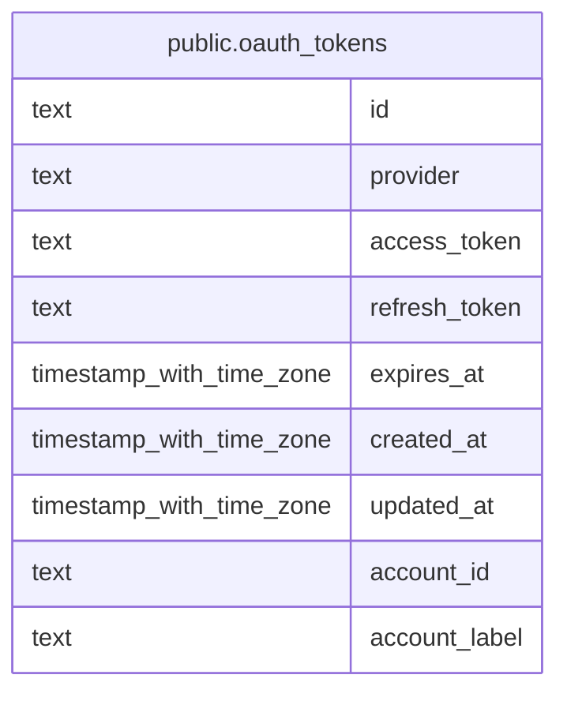

# public.oauth_tokens

## Columns

| Name          | Type                     | Default                 | Nullable | Children | Parents | Comment |
| ------------- | ------------------------ | ----------------------- | -------- | -------- | ------- | ------- |
| id            | text                     |                         | false    |          |         |         |
| provider      | text                     | 'google_calendar'::text | false    |          |         |         |
| access_token  | text                     |                         | false    |          |         |         |
| refresh_token | text                     |                         | true     |          |         |         |
| expires_at    | timestamp with time zone |                         | true     |          |         |         |
| created_at    | timestamp with time zone | now()                   | false    |          |         |         |
| updated_at    | timestamp with time zone | now()                   | false    |          |         |         |
| account_id    | text                     |                         | false    |          |         |         |
| account_label | text                     |                         | true     |          |         |         |

## Constraints

| Name                                   | Type        | Definition                                                                                          |
| -------------------------------------- | ----------- | --------------------------------------------------------------------------------------------------- |
| oauth_tokens_refresh_metadata_required | CHECK       | CHECK (((provider = 'github'::text) OR ((refresh_token IS NOT NULL) AND (expires_at IS NOT NULL)))) |
| oauth_tokens_pkey                      | PRIMARY KEY | PRIMARY KEY (id)                                                                                    |
| uq_oauth_tokens_provider_account_id    | UNIQUE      | UNIQUE (provider, account_id)                                                                       |

## Indexes

| Name                                | Definition                                                                                                        |
| ----------------------------------- | ----------------------------------------------------------------------------------------------------------------- |
| oauth_tokens_pkey                   | CREATE UNIQUE INDEX oauth_tokens_pkey ON public.oauth_tokens USING btree (id)                                     |
| uq_oauth_tokens_provider_account_id | CREATE UNIQUE INDEX uq_oauth_tokens_provider_account_id ON public.oauth_tokens USING btree (provider, account_id) |

## Relations

---

> Generated by [tbls](https://github.com/k1LoW/tbls)
