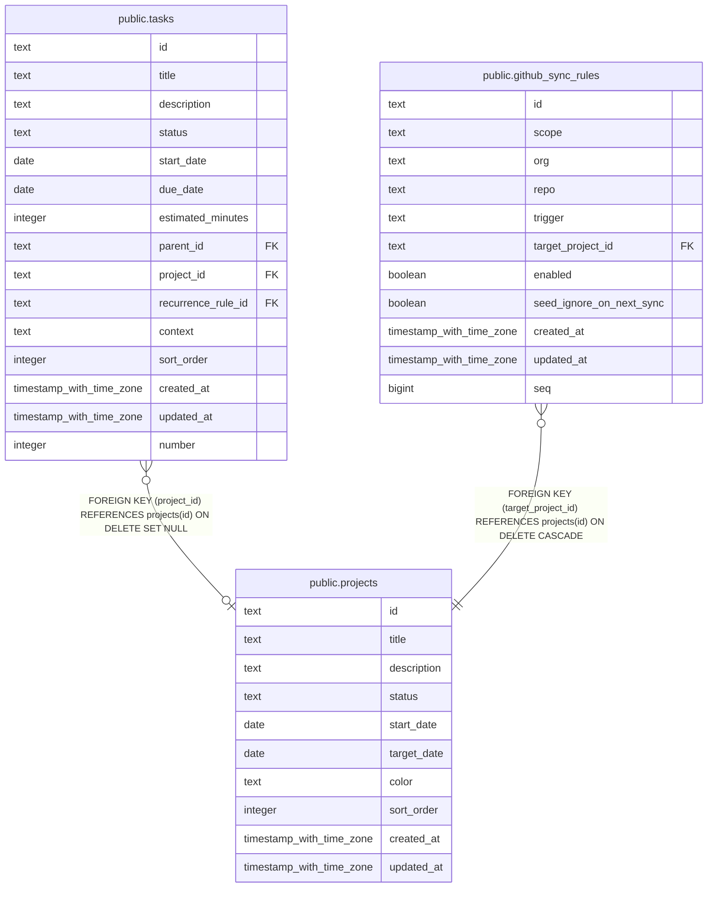

# public.projects

## Columns

| Name        | Type                     | Default        | Nullable | Children                                                                                | Parents | Comment |
| ----------- | ------------------------ | -------------- | -------- | --------------------------------------------------------------------------------------- | ------- | ------- |
| id          | text                     |                | false    | [public.tasks](public.tasks.md) [public.github_sync_rules](public.github_sync_rules.md) |         |         |
| title       | text                     |                | false    |                                                                                         |         |         |
| description | text                     |                | true     |                                                                                         |         |         |
| status      | text                     | 'active'::text | false    |                                                                                         |         |         |
| start_date  | date                     |                | true     |                                                                                         |         |         |
| target_date | date                     |                | true     |                                                                                         |         |         |
| color       | text                     |                | true     |                                                                                         |         |         |
| sort_order  | integer                  | 0              | false    |                                                                                         |         |         |
| created_at  | timestamp with time zone | now()          | false    |                                                                                         |         |         |
| updated_at  | timestamp with time zone | now()          | false    |                                                                                         |         |         |

## Constraints

| Name          | Type        | Definition       |
| ------------- | ----------- | ---------------- |
| projects_pkey | PRIMARY KEY | PRIMARY KEY (id) |

## Indexes

| Name                    | Definition                                                                       |
| ----------------------- | -------------------------------------------------------------------------------- |
| projects_pkey           | CREATE UNIQUE INDEX projects_pkey ON public.projects USING btree (id)            |
| idx_projects_status     | CREATE INDEX idx_projects_status ON public.projects USING btree (status)         |
| idx_projects_sort_order | CREATE INDEX idx_projects_sort_order ON public.projects USING btree (sort_order) |

## Relations

---

> Generated by [tbls](https://github.com/k1LoW/tbls)
