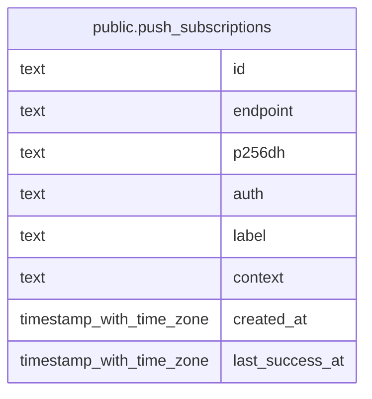

# public.push_subscriptions

## Columns

| Name            | Type                     | Default | Nullable | Children | Parents | Comment |
| --------------- | ------------------------ | ------- | -------- | -------- | ------- | ------- |
| id              | text                     |         | false    |          |         |         |
| endpoint        | text                     |         | false    |          |         |         |
| p256dh          | text                     |         | false    |          |         |         |
| auth            | text                     |         | false    |          |         |         |
| label           | text                     |         | true     |          |         |         |
| context         | text                     |         | false    |          |         |         |
| created_at      | timestamp with time zone | now()   | false    |          |         |         |
| last_success_at | timestamp with time zone |         | true     |          |         |         |

## Constraints

| Name                               | Type        | Definition        |
| ---------------------------------- | ----------- | ----------------- |
| push_subscriptions_pkey            | PRIMARY KEY | PRIMARY KEY (id)  |
| push_subscriptions_endpoint_unique | UNIQUE      | UNIQUE (endpoint) |

## Indexes

| Name                               | Definition                                                                                                 |
| ---------------------------------- | ---------------------------------------------------------------------------------------------------------- |
| push_subscriptions_pkey            | CREATE UNIQUE INDEX push_subscriptions_pkey ON public.push_subscriptions USING btree (id)                  |
| push_subscriptions_endpoint_unique | CREATE UNIQUE INDEX push_subscriptions_endpoint_unique ON public.push_subscriptions USING btree (endpoint) |

## Relations

---

> Generated by [tbls](https://github.com/k1LoW/tbls)
