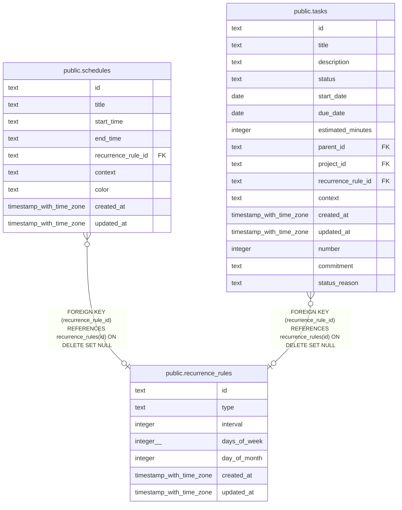

# public.recurrence_rules

## Columns

| Name         | Type                     | Default | Nullable | Children                                                                | Parents | Comment |
| ------------ | ------------------------ | ------- | -------- | ----------------------------------------------------------------------- | ------- | ------- |
| id           | text                     |         | false    | [public.schedules](public.schedules.md) [public.tasks](public.tasks.md) |         |         |
| type         | text                     |         | false    |                                                                         |         |         |
| interval     | integer                  | 1       | false    |                                                                         |         |         |
| days_of_week | integer[]                |         | true     |                                                                         |         |         |
| day_of_month | integer                  |         | true     |                                                                         |         |         |
| created_at   | timestamp with time zone | now()   | false    |                                                                         |         |         |
| updated_at   | timestamp with time zone | now()   | false    |                                                                         |         |         |

## Constraints

| Name                  | Type        | Definition       |
| --------------------- | ----------- | ---------------- |
| recurrence_rules_pkey | PRIMARY KEY | PRIMARY KEY (id) |

## Indexes

| Name                  | Definition                                                                            |
| --------------------- | ------------------------------------------------------------------------------------- |
| recurrence_rules_pkey | CREATE UNIQUE INDEX recurrence_rules_pkey ON public.recurrence_rules USING btree (id) |

## Relations

---

> Generated by [tbls](https://github.com/k1LoW/tbls)
