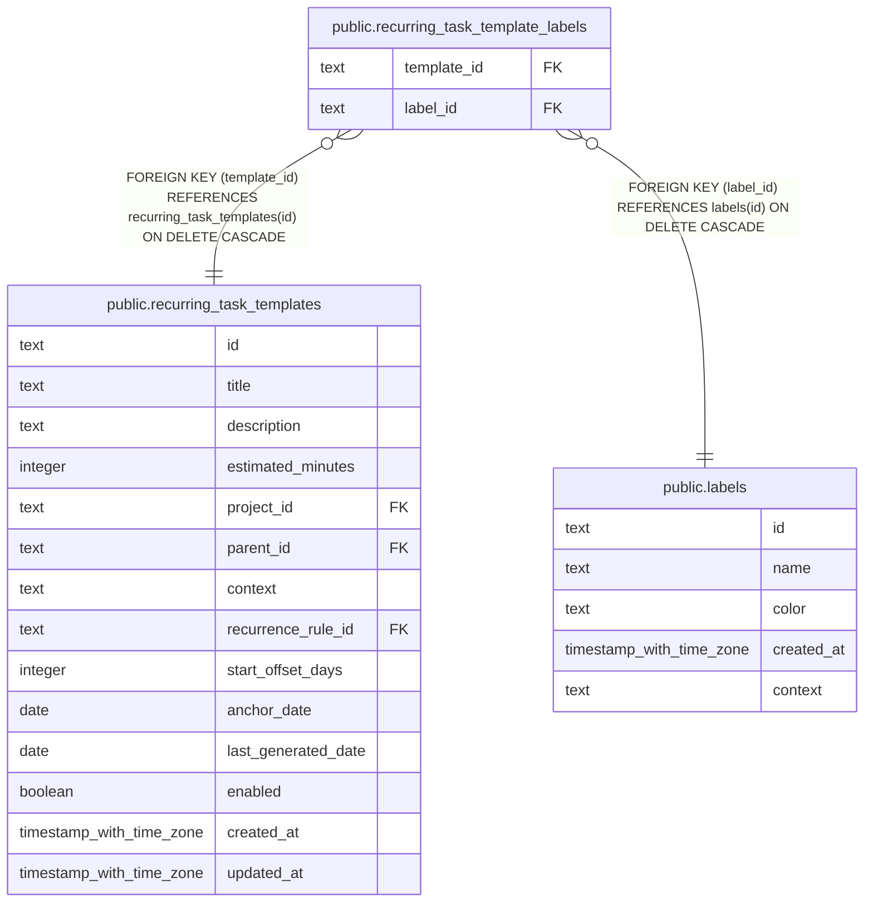

# public.recurring_task_template_labels

## Columns

| Name        | Type | Default | Nullable | Children | Parents                                                               | Comment |
| ----------- | ---- | ------- | -------- | -------- | --------------------------------------------------------------------- | ------- |
| template_id | text |         | false    |          | [public.recurring_task_templates](public.recurring_task_templates.md) |         |
| label_id    | text |         | false    |          | [public.labels](public.labels.md)                                     |         |

## Constraints

| Name                                                            | Type        | Definition                                                                          |
| --------------------------------------------------------------- | ----------- | ----------------------------------------------------------------------------------- |
| recurring_task_template_labels_label_id_labels_id_fk            | FOREIGN KEY | FOREIGN KEY (label_id) REFERENCES labels(id) ON DELETE CASCADE                      |
| recurring_task_template_labels_template_id_label_id_pk          | PRIMARY KEY | PRIMARY KEY (template_id, label_id)                                                 |
| recurring_task_template_labels_template_id_recurring_task_templ | FOREIGN KEY | FOREIGN KEY (template_id) REFERENCES recurring_task_templates(id) ON DELETE CASCADE |

## Indexes

| Name                                                   | Definition                                                                                                                                              |
| ------------------------------------------------------ | ------------------------------------------------------------------------------------------------------------------------------------------------------- |
| recurring_task_template_labels_template_id_label_id_pk | CREATE UNIQUE INDEX recurring_task_template_labels_template_id_label_id_pk ON public.recurring_task_template_labels USING btree (template_id, label_id) |
| idx_recurring_task_template_labels_template_id         | CREATE INDEX idx_recurring_task_template_labels_template_id ON public.recurring_task_template_labels USING btree (template_id)                          |
| idx_recurring_task_template_labels_label_id            | CREATE INDEX idx_recurring_task_template_labels_label_id ON public.recurring_task_template_labels USING btree (label_id)                                |

## Relations

---

> Generated by [tbls](https://github.com/k1LoW/tbls)
