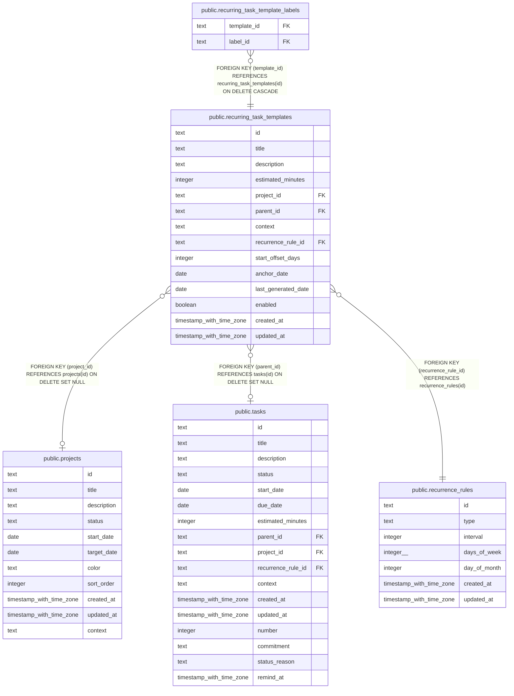

# public.recurring_task_templates

## Columns

| Name                | Type                     | Default          | Nullable | Children                                                                          | Parents                                               | Comment |
| ------------------- | ------------------------ | ---------------- | -------- | --------------------------------------------------------------------------------- | ----------------------------------------------------- | ------- |
| id                  | text                     |                  | false    | [public.recurring_task_template_labels](public.recurring_task_template_labels.md) |                                                       |         |
| title               | text                     |                  | false    |                                                                                   |                                                       |         |
| description         | text                     |                  | true     |                                                                                   |                                                       |         |
| estimated_minutes   | integer                  |                  | true     |                                                                                   |                                                       |         |
| project_id          | text                     |                  | true     |                                                                                   | [public.projects](public.projects.md)                 |         |
| parent_id           | text                     |                  | true     |                                                                                   | [public.tasks](public.tasks.md)                       |         |
| context             | text                     | 'personal'::text | false    |                                                                                   |                                                       |         |
| recurrence_rule_id  | text                     |                  | false    |                                                                                   | [public.recurrence_rules](public.recurrence_rules.md) |         |
| start_offset_days   | integer                  |                  | true     |                                                                                   |                                                       |         |
| anchor_date         | date                     |                  | false    |                                                                                   |                                                       |         |
| last_generated_date | date                     |                  | true     |                                                                                   |                                                       |         |
| enabled             | boolean                  | true             | false    |                                                                                   |                                                       |         |
| created_at          | timestamp with time zone | now()            | false    |                                                                                   |                                                       |         |
| updated_at          | timestamp with time zone | now()            | false    |                                                                                   |                                                       |         |

## Constraints

| Name                                                            | Type        | Definition                                                          |
| --------------------------------------------------------------- | ----------- | ------------------------------------------------------------------- |
| recurring_task_templates_project_id_projects_id_fk              | FOREIGN KEY | FOREIGN KEY (project_id) REFERENCES projects(id) ON DELETE SET NULL |
| recurring_task_templates_recurrence_rule_id_recurrence_rules_id | FOREIGN KEY | FOREIGN KEY (recurrence_rule_id) REFERENCES recurrence_rules(id)    |
| recurring_task_templates_parent_id_tasks_id_fk                  | FOREIGN KEY | FOREIGN KEY (parent_id) REFERENCES tasks(id) ON DELETE SET NULL     |
| recurring_task_templates_pkey                                   | PRIMARY KEY | PRIMARY KEY (id)                                                    |

## Indexes

| Name                                            | Definition                                                                                                                       |
| ----------------------------------------------- | -------------------------------------------------------------------------------------------------------------------------------- |
| recurring_task_templates_pkey                   | CREATE UNIQUE INDEX recurring_task_templates_pkey ON public.recurring_task_templates USING btree (id)                            |
| idx_recurring_task_templates_project_id         | CREATE INDEX idx_recurring_task_templates_project_id ON public.recurring_task_templates USING btree (project_id)                 |
| idx_recurring_task_templates_parent_id          | CREATE INDEX idx_recurring_task_templates_parent_id ON public.recurring_task_templates USING btree (parent_id)                   |
| idx_recurring_task_templates_context            | CREATE INDEX idx_recurring_task_templates_context ON public.recurring_task_templates USING btree (context)                       |
| idx_recurring_task_templates_enabled            | CREATE INDEX idx_recurring_task_templates_enabled ON public.recurring_task_templates USING btree (enabled)                       |
| idx_recurring_task_templates_recurrence_rule_id | CREATE INDEX idx_recurring_task_templates_recurrence_rule_id ON public.recurring_task_templates USING btree (recurrence_rule_id) |

## Relations

---

> Generated by [tbls](https://github.com/k1LoW/tbls)
