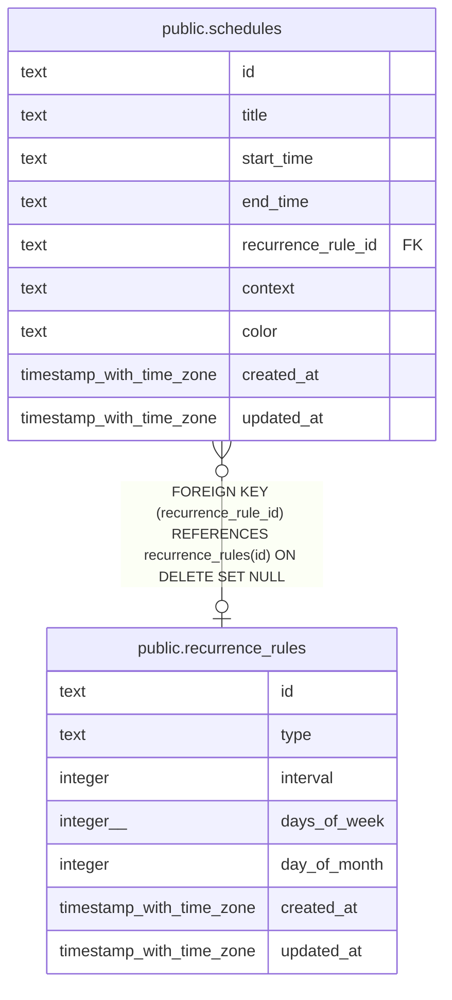

# public.schedules

## Columns

| Name               | Type                     | Default          | Nullable | Children | Parents                                               | Comment |
| ------------------ | ------------------------ | ---------------- | -------- | -------- | ----------------------------------------------------- | ------- |
| id                 | text                     |                  | false    |          |                                                       |         |
| title              | text                     |                  | false    |          |                                                       |         |
| start_time         | text                     |                  | false    |          |                                                       |         |
| end_time           | text                     |                  | false    |          |                                                       |         |
| recurrence_rule_id | text                     |                  | true     |          | [public.recurrence_rules](public.recurrence_rules.md) |         |
| context            | text                     | 'personal'::text | false    |          |                                                       |         |
| color              | text                     |                  | true     |          |                                                       |         |
| created_at         | timestamp with time zone | now()            | false    |          |                                                       |         |
| updated_at         | timestamp with time zone | now()            | false    |          |                                                       |         |

## Constraints

| Name                                                | Type        | Definition                                                                          |
| --------------------------------------------------- | ----------- | ----------------------------------------------------------------------------------- |
| schedules_recurrence_rule_id_recurrence_rules_id_fk | FOREIGN KEY | FOREIGN KEY (recurrence_rule_id) REFERENCES recurrence_rules(id) ON DELETE SET NULL |
| schedules_pkey                                      | PRIMARY KEY | PRIMARY KEY (id)                                                                    |

## Indexes

| Name                             | Definition                                                                                         |
| -------------------------------- | -------------------------------------------------------------------------------------------------- |
| schedules_pkey                   | CREATE UNIQUE INDEX schedules_pkey ON public.schedules USING btree (id)                            |
| idx_schedules_recurrence_rule_id | CREATE INDEX idx_schedules_recurrence_rule_id ON public.schedules USING btree (recurrence_rule_id) |
| idx_schedules_context            | CREATE INDEX idx_schedules_context ON public.schedules USING btree (context)                       |

## Relations

---

> Generated by [tbls](https://github.com/k1LoW/tbls)
