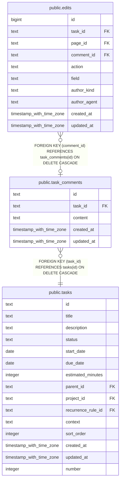

# public.task_comments

## Columns

| Name       | Type                     | Default | Nullable | Children                        | Parents                         | Comment |
| ---------- | ------------------------ | ------- | -------- | ------------------------------- | ------------------------------- | ------- |
| id         | text                     |         | false    | [public.edits](public.edits.md) |                                 |         |
| task_id    | text                     |         | false    |                                 | [public.tasks](public.tasks.md) |         |
| content    | text                     |         | false    |                                 |                                 |         |
| created_at | timestamp with time zone | now()   | false    |                                 |                                 |         |
| updated_at | timestamp with time zone | now()   | false    |                                 |                                 |         |

## Constraints

| Name                              | Type        | Definition                                                   |
| --------------------------------- | ----------- | ------------------------------------------------------------ |
| task_comments_pkey                | PRIMARY KEY | PRIMARY KEY (id)                                             |
| task_comments_task_id_tasks_id_fk | FOREIGN KEY | FOREIGN KEY (task_id) REFERENCES tasks(id) ON DELETE CASCADE |

## Indexes

| Name                         | Definition                                                                                          |
| ---------------------------- | --------------------------------------------------------------------------------------------------- |
| task_comments_pkey           | CREATE UNIQUE INDEX task_comments_pkey ON public.task_comments USING btree (id)                     |
| idx_task_comments_task_id    | CREATE INDEX idx_task_comments_task_id ON public.task_comments USING btree (task_id)                |
| idx_task_comments_created_at | CREATE INDEX idx_task_comments_created_at ON public.task_comments USING btree (task_id, created_at) |

## Relations

---

> Generated by [tbls](https://github.com/k1LoW/tbls)
