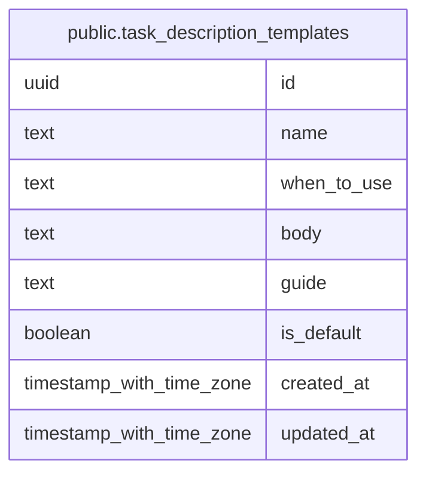

# public.task_description_templates

## Description

Templates for structuring task descriptions.

## Columns

| Name        | Type                     | Default           | Nullable | Children | Parents | Comment                                                                           |
| ----------- | ------------------------ | ----------------- | -------- | -------- | ------- | --------------------------------------------------------------------------------- |
| id          | uuid                     | gen_random_uuid() | false    |          |         |                                                                                   |
| name        | text                     |                   | false    |          |         | Unique name used to look up a description template.                               |
| when_to_use | text                     |                   | false    |          |         | Type of work for which the template should be selected.                           |
| body        | text                     |                   | false    |          |         | Markdown skeleton intended for a task description.                                |
| guide       | text                     |                   | false    |          |         | Writing instructions for completing each section of the body.                     |
| is_default  | boolean                  | false             | false    |          |         | Whether the template is selected by default; at most one template may be default. |
| created_at  | timestamp with time zone | now()             | false    |          |         |                                                                                   |
| updated_at  | timestamp with time zone | now()             | false    |          |         |                                                                                   |

## Constraints

| Name                                   | Type        | Definition       |
| -------------------------------------- | ----------- | ---------------- |
| task_description_templates_pkey        | PRIMARY KEY | PRIMARY KEY (id) |
| task_description_templates_name_unique | UNIQUE      | UNIQUE (name)    |

## Indexes

| Name                                      | Definition                                                                                                                                            |
| ----------------------------------------- | ----------------------------------------------------------------------------------------------------------------------------------------------------- |
| task_description_templates_pkey           | CREATE UNIQUE INDEX task_description_templates_pkey ON public.task_description_templates USING btree (id)                                             |
| task_description_templates_name_unique    | CREATE UNIQUE INDEX task_description_templates_name_unique ON public.task_description_templates USING btree (name)                                    |
| task_description_templates_default_unique | CREATE UNIQUE INDEX task_description_templates_default_unique ON public.task_description_templates USING btree (is_default) WHERE (is_default = true) |

## Relations

---

> Generated by [tbls](https://github.com/k1LoW/tbls)
