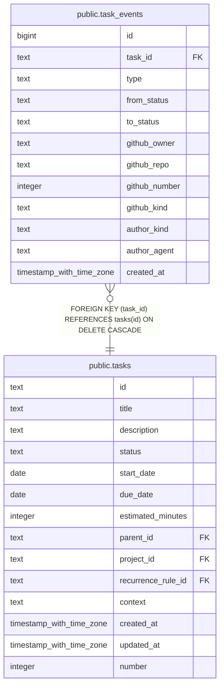

# public.task_events

## Columns

| Name          | Type                     | Default | Nullable | Children | Parents                         | Comment |
| ------------- | ------------------------ | ------- | -------- | -------- | ------------------------------- | ------- |
| id            | bigint                   |         | false    |          |                                 |         |
| task_id       | text                     |         | false    |          | [public.tasks](public.tasks.md) |         |
| type          | text                     |         | false    |          |                                 |         |
| from_status   | text                     |         | true     |          |                                 |         |
| to_status     | text                     |         | true     |          |                                 |         |
| github_owner  | text                     |         | true     |          |                                 |         |
| github_repo   | text                     |         | true     |          |                                 |         |
| github_number | integer                  |         | true     |          |                                 |         |
| github_kind   | text                     |         | true     |          |                                 |         |
| author_kind   | text                     |         | false    |          |                                 |         |
| author_agent  | text                     |         | true     |          |                                 |         |
| created_at    | timestamp with time zone | now()   | false    |          |                                 |         |

## Constraints

| Name                                      | Type        | Definition                                                                                                                                                                                                                                                                                                                                                                                                                                                              |
| ----------------------------------------- | ----------- | ----------------------------------------------------------------------------------------------------------------------------------------------------------------------------------------------------------------------------------------------------------------------------------------------------------------------------------------------------------------------------------------------------------------------------------------------------------------------- |
| task_events_author_agent_required_for_llm | CHECK       | CHECK (((author_kind = 'llm'::text) = (author_agent IS NOT NULL)))                                                                                                                                                                                                                                                                                                                                                                                                      |
| task_events_author_kind_check             | CHECK       | CHECK ((author_kind = ANY (ARRAY['human'::text, 'llm'::text, 'system'::text])))                                                                                                                                                                                                                                                                                                                                                                                         |
| task_events_payload_check                 | CHECK       | CHECK ((((type = 'status_changed'::text) AND (from_status IS NOT NULL) AND (to_status IS NOT NULL) AND (github_owner IS NULL) AND (github_repo IS NULL) AND (github_number IS NULL) AND (github_kind IS NULL)) OR ((type = ANY (ARRAY['github_linked'::text, 'github_unlinked'::text])) AND (from_status IS NULL) AND (to_status IS NULL) AND (github_owner IS NOT NULL) AND (github_repo IS NOT NULL) AND (github_number IS NOT NULL) AND (github_kind IS NOT NULL)))) |
| task_events_type_check                    | CHECK       | CHECK ((type = ANY (ARRAY['status_changed'::text, 'github_linked'::text, 'github_unlinked'::text])))                                                                                                                                                                                                                                                                                                                                                                    |
| task_events_task_id_tasks_id_fk           | FOREIGN KEY | FOREIGN KEY (task_id) REFERENCES tasks(id) ON DELETE CASCADE                                                                                                                                                                                                                                                                                                                                                                                                            |
| task_events_pkey                          | PRIMARY KEY | PRIMARY KEY (id)                                                                                                                                                                                                                                                                                                                                                                                                                                                        |

## Indexes

| Name                               | Definition                                                                                              |
| ---------------------------------- | ------------------------------------------------------------------------------------------------------- |
| task_events_pkey                   | CREATE UNIQUE INDEX task_events_pkey ON public.task_events USING btree (id)                             |
| idx_task_events_task_id_created_at | CREATE INDEX idx_task_events_task_id_created_at ON public.task_events USING btree (task_id, created_at) |

## Relations

---

> Generated by [tbls](https://github.com/k1LoW/tbls)
