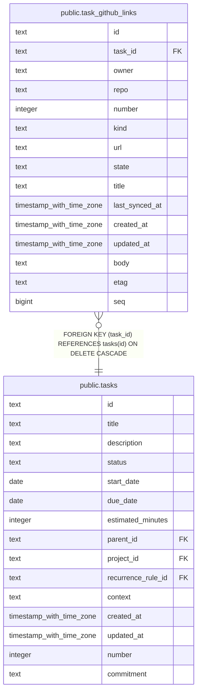

# public.task_github_links

## Columns

| Name           | Type                     | Default | Nullable | Children | Parents                         | Comment |
| -------------- | ------------------------ | ------- | -------- | -------- | ------------------------------- | ------- |
| id             | text                     |         | false    |          |                                 |         |
| task_id        | text                     |         | false    |          | [public.tasks](public.tasks.md) |         |
| owner          | text                     |         | false    |          |                                 |         |
| repo           | text                     |         | false    |          |                                 |         |
| number         | integer                  |         | false    |          |                                 |         |
| kind           | text                     |         | false    |          |                                 |         |
| url            | text                     |         | false    |          |                                 |         |
| state          | text                     |         | false    |          |                                 |         |
| title          | text                     |         | false    |          |                                 |         |
| last_synced_at | timestamp with time zone | now()   | false    |          |                                 |         |
| created_at     | timestamp with time zone | now()   | false    |          |                                 |         |
| updated_at     | timestamp with time zone | now()   | false    |          |                                 |         |
| body           | text                     |         | true     |          |                                 |         |
| etag           | text                     |         | true     |          |                                 |         |
| seq            | bigint                   |         | false    |          |                                 |         |

## Constraints

| Name                                  | Type        | Definition                                                           |
| ------------------------------------- | ----------- | -------------------------------------------------------------------- |
| task_github_links_state_kind_check    | CHECK       | CHECK (((kind = 'pull_request'::text) OR (state <> 'merged'::text))) |
| task_github_links_task_id_tasks_id_fk | FOREIGN KEY | FOREIGN KEY (task_id) REFERENCES tasks(id) ON DELETE CASCADE         |
| task_github_links_pkey                | PRIMARY KEY | PRIMARY KEY (id)                                                     |
| uq_task_github_links_repo_number      | UNIQUE      | UNIQUE (owner, repo, number)                                         |

## Indexes

| Name                                     | Definition                                                                                                          |
| ---------------------------------------- | ------------------------------------------------------------------------------------------------------------------- |
| task_github_links_pkey                   | CREATE UNIQUE INDEX task_github_links_pkey ON public.task_github_links USING btree (id)                             |
| uq_task_github_links_repo_number         | CREATE UNIQUE INDEX uq_task_github_links_repo_number ON public.task_github_links USING btree (owner, repo, number)  |
| idx_task_github_links_task_id_created_at | CREATE INDEX idx_task_github_links_task_id_created_at ON public.task_github_links USING btree (task_id, created_at) |

## Relations

---

> Generated by [tbls](https://github.com/k1LoW/tbls)
