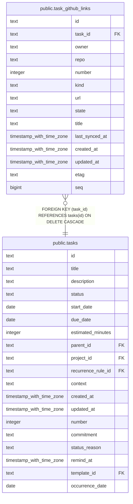

# public.task_github_links

## Description

GitHub issues and pull requests linked to tasks.

## Columns

| Name           | Type                     | Default | Nullable | Children | Parents                         | Comment                                                                             |
| -------------- | ------------------------ | ------- | -------- | -------- | ------------------------------- | ----------------------------------------------------------------------------------- |
| id             | text                     |         | false    |          |                                 |                                                                                     |
| task_id        | text                     |         | false    |          | [public.tasks](public.tasks.md) | Task linked to this GitHub item.                                                    |
| owner          | text                     |         | false    |          |                                 | Owner of the repository containing this item.                                       |
| repo           | text                     |         | false    |          |                                 | Repository containing this item.                                                    |
| number         | integer                  |         | false    |          |                                 | GitHub issue or pull request number.                                                |
| kind           | text                     |         | false    |          |                                 | GitHub item type: issue or pull_request.                                            |
| url            | text                     |         | false    |          |                                 | URL of the linked GitHub item.                                                      |
| state          | text                     |         | false    |          |                                 | Cached item state: open, closed, or merged.                                         |
| title          | text                     |         | false    |          |                                 | Cached title of the linked GitHub item.                                             |
| last_synced_at | timestamp with time zone | now()   | false    |          |                                 | Time when the linked item's state and title were last synchronized.                 |
| created_at     | timestamp with time zone | now()   | false    |          |                                 |                                                                                     |
| updated_at     | timestamp with time zone | now()   | false    |          |                                 |                                                                                     |
| etag           | text                     |         | true     |          |                                 | ETag from the latest GitHub response, used for conditional synchronization.         |
| seq            | bigint                   |         | false    |          |                                 | Insertion-order sequence used to break ties between links created at the same time. |

## Constraints

| Name                                  | Type        | Definition                                                           |
| ------------------------------------- | ----------- | -------------------------------------------------------------------- |
| task_github_links_state_kind_check    | CHECK       | CHECK (((kind = 'pull_request'::text) OR (state <> 'merged'::text))) |
| task_github_links_task_id_tasks_id_fk | FOREIGN KEY | FOREIGN KEY (task_id) REFERENCES tasks(id) ON DELETE CASCADE         |
| task_github_links_pkey                | PRIMARY KEY | PRIMARY KEY (id)                                                     |
| uq_task_github_links_repo_number      | UNIQUE      | UNIQUE (owner, repo, number)                                         |

## Indexes

| Name                                     | Definition                                                                                                          |
| ---------------------------------------- | ------------------------------------------------------------------------------------------------------------------- |
| task_github_links_pkey                   | CREATE UNIQUE INDEX task_github_links_pkey ON public.task_github_links USING btree (id)                             |
| uq_task_github_links_repo_number         | CREATE UNIQUE INDEX uq_task_github_links_repo_number ON public.task_github_links USING btree (owner, repo, number)  |
| idx_task_github_links_task_id_created_at | CREATE INDEX idx_task_github_links_task_id_created_at ON public.task_github_links USING btree (task_id, created_at) |

## Relations

```mermaid
erDiagram

"public.task_github_links" }o--|| "public.tasks" : "FOREIGN KEY (task_id) REFERENCES tasks(id) ON DELETE CASCADE"

"public.task_github_links" {
  text id
  text task_id FK
  text owner
  text repo
  integer number
  text kind
  text url
  text state
  text title
  timestamp_with_time_zone last_synced_at
  timestamp_with_time_zone created_at
  timestamp_with_time_zone updated_at
  text etag
  bigint seq
}
"public.tasks" {
  text id
  text title
  text description
  text status
  date start_date
  date due_date
  integer estimated_minutes
  text parent_id FK
  text project_id FK
  text recurrence_rule_id FK
  text context
  timestamp_with_time_zone created_at
  timestamp_with_time_zone updated_at
  integer number
  text commitment
  text status_reason
  timestamp_with_time_zone remind_at
  text template_id FK
  date occurrence_date
}
```

---

> Generated by [tbls](https://github.com/k1LoW/tbls)
