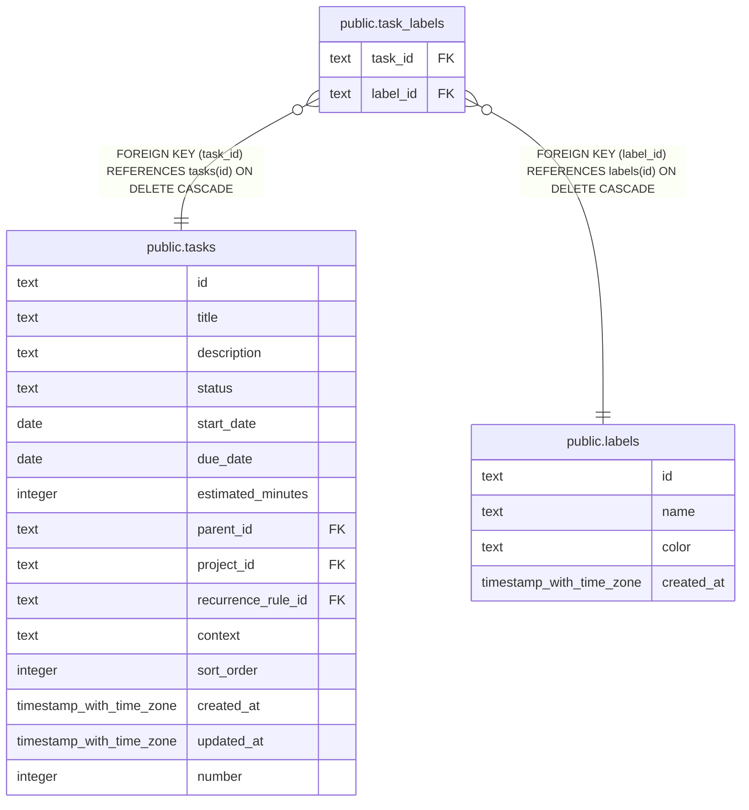

# public.task_labels

## Columns

| Name | Type | Default | Nullable | Children | Parents | Comment |
| ---- | ---- | ------- | -------- | -------- | ------- | ------- |
| task_id | text |  | false |  | [public.tasks](public.tasks.md) |  |
| label_id | text |  | false |  | [public.labels](public.labels.md) |  |

## Constraints

| Name | Type | Definition |
| ---- | ---- | ---------- |
| task_labels_label_id_labels_id_fk | FOREIGN KEY | FOREIGN KEY (label_id) REFERENCES labels(id) ON DELETE CASCADE |
| task_labels_task_id_label_id_pk | PRIMARY KEY | PRIMARY KEY (task_id, label_id) |
| task_labels_task_id_tasks_id_fk | FOREIGN KEY | FOREIGN KEY (task_id) REFERENCES tasks(id) ON DELETE CASCADE |

## Indexes

| Name | Definition |
| ---- | ---------- |
| task_labels_task_id_label_id_pk | CREATE UNIQUE INDEX task_labels_task_id_label_id_pk ON public.task_labels USING btree (task_id, label_id) |
| idx_task_labels_task_id | CREATE INDEX idx_task_labels_task_id ON public.task_labels USING btree (task_id) |
| idx_task_labels_label_id | CREATE INDEX idx_task_labels_label_id ON public.task_labels USING btree (label_id) |

## Relations

---

> Generated by [tbls](https://github.com/k1LoW/tbls)
