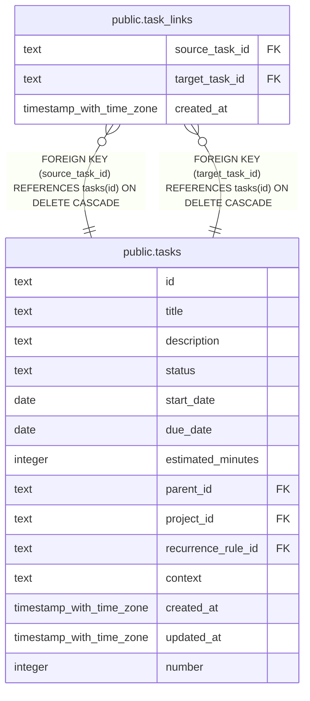

# public.task_links

## Columns

| Name           | Type                     | Default | Nullable | Children | Parents                         | Comment |
| -------------- | ------------------------ | ------- | -------- | -------- | ------------------------------- | ------- |
| source_task_id | text                     |         | false    |          | [public.tasks](public.tasks.md) |         |
| target_task_id | text                     |         | false    |          | [public.tasks](public.tasks.md) |         |
| created_at     | timestamp with time zone | now()   | false    |          |                                 |         |

## Constraints

| Name                                        | Type        | Definition                                                          |
| ------------------------------------------- | ----------- | ------------------------------------------------------------------- |
| task_links_no_self_link                     | CHECK       | CHECK ((source_task_id <> target_task_id))                          |
| task_links_source_task_id_tasks_id_fk       | FOREIGN KEY | FOREIGN KEY (source_task_id) REFERENCES tasks(id) ON DELETE CASCADE |
| task_links_target_task_id_tasks_id_fk       | FOREIGN KEY | FOREIGN KEY (target_task_id) REFERENCES tasks(id) ON DELETE CASCADE |
| task_links_source_task_id_target_task_id_pk | PRIMARY KEY | PRIMARY KEY (source_task_id, target_task_id)                        |

## Indexes

| Name                                        | Definition                                                                                                                        |
| ------------------------------------------- | --------------------------------------------------------------------------------------------------------------------------------- |
| task_links_source_task_id_target_task_id_pk | CREATE UNIQUE INDEX task_links_source_task_id_target_task_id_pk ON public.task_links USING btree (source_task_id, target_task_id) |
| idx_task_links_target_task_id               | CREATE INDEX idx_task_links_target_task_id ON public.task_links USING btree (target_task_id)                                      |

## Relations

---

> Generated by [tbls](https://github.com/k1LoW/tbls)
