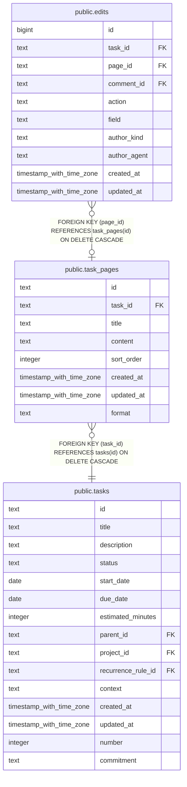

# public.task_pages

## Columns

| Name       | Type                     | Default          | Nullable | Children                        | Parents                         | Comment |
| ---------- | ------------------------ | ---------------- | -------- | ------------------------------- | ------------------------------- | ------- |
| id         | text                     |                  | false    | [public.edits](public.edits.md) |                                 |         |
| task_id    | text                     |                  | false    |                                 | [public.tasks](public.tasks.md) |         |
| title      | text                     |                  | false    |                                 |                                 |         |
| content    | text                     | ''::text         | false    |                                 |                                 |         |
| sort_order | integer                  | 0                | false    |                                 |                                 |         |
| created_at | timestamp with time zone | now()            | false    |                                 |                                 |         |
| updated_at | timestamp with time zone | now()            | false    |                                 |                                 |         |
| format     | text                     | 'markdown'::text | false    |                                 |                                 |         |

## Constraints

| Name                           | Type        | Definition                                                   |
| ------------------------------ | ----------- | ------------------------------------------------------------ |
| task_pages_pkey                | PRIMARY KEY | PRIMARY KEY (id)                                             |
| task_pages_task_id_tasks_id_fk | FOREIGN KEY | FOREIGN KEY (task_id) REFERENCES tasks(id) ON DELETE CASCADE |

## Indexes

| Name                   | Definition                                                                     |
| ---------------------- | ------------------------------------------------------------------------------ |
| task_pages_pkey        | CREATE UNIQUE INDEX task_pages_pkey ON public.task_pages USING btree (id)      |
| idx_task_pages_task_id | CREATE INDEX idx_task_pages_task_id ON public.task_pages USING btree (task_id) |

## Relations

---

> Generated by [tbls](https://github.com/k1LoW/tbls)
