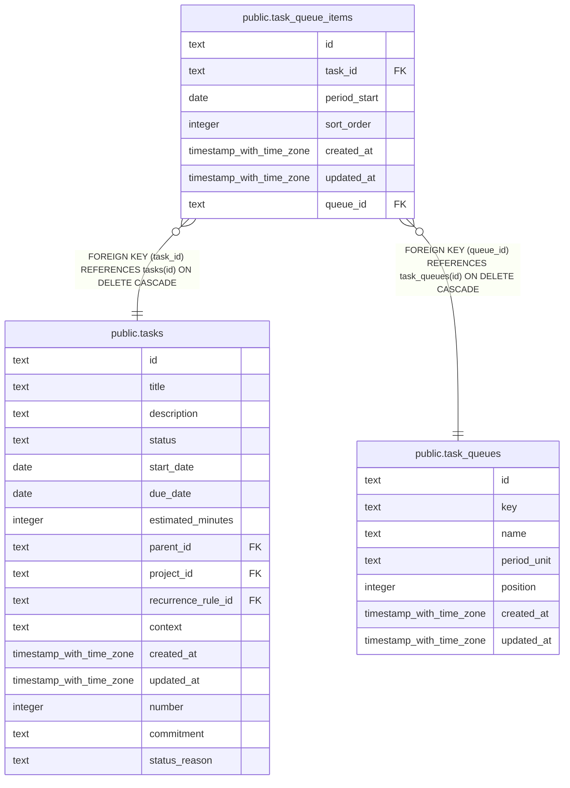

# public.task_queue_items

## Columns

| Name         | Type                     | Default | Nullable | Children | Parents                                     | Comment |
| ------------ | ------------------------ | ------- | -------- | -------- | ------------------------------------------- | ------- |
| id           | text                     |         | false    |          |                                             |         |
| task_id      | text                     |         | false    |          | [public.tasks](public.tasks.md)             |         |
| period_start | date                     |         | true     |          |                                             |         |
| sort_order   | integer                  | 0       | false    |          |                                             |         |
| created_at   | timestamp with time zone | now()   | false    |          |                                             |         |
| updated_at   | timestamp with time zone | now()   | false    |          |                                             |         |
| queue_id     | text                     |         | false    |          | [public.task_queues](public.task_queues.md) |         |

## Constraints

| Name                                        | Type        | Definition                                                          |
| ------------------------------------------- | ----------- | ------------------------------------------------------------------- |
| task_queue_items_task_id_tasks_id_fk        | FOREIGN KEY | FOREIGN KEY (task_id) REFERENCES tasks(id) ON DELETE CASCADE        |
| task_queue_items_pkey                       | PRIMARY KEY | PRIMARY KEY (id)                                                    |
| task_queue_items_queue_id_task_queues_id_fk | FOREIGN KEY | FOREIGN KEY (queue_id) REFERENCES task_queues(id) ON DELETE CASCADE |
| task_queue_items_queue_period_task_unique   | UNIQUE      | UNIQUE NULLS NOT DISTINCT (queue_id, period_start, task_id)         |

## Indexes

| Name                                      | Definition                                                                                                                                                |
| ----------------------------------------- | --------------------------------------------------------------------------------------------------------------------------------------------------------- |
| task_queue_items_pkey                     | CREATE UNIQUE INDEX task_queue_items_pkey ON public.task_queue_items USING btree (id)                                                                     |
| task_queue_items_queue_period_task_unique | CREATE UNIQUE INDEX task_queue_items_queue_period_task_unique ON public.task_queue_items USING btree (queue_id, period_start, task_id) NULLS NOT DISTINCT |
| idx_task_queue_items_queue_period_sort    | CREATE INDEX idx_task_queue_items_queue_period_sort ON public.task_queue_items USING btree (queue_id, period_start, sort_order)                           |
| idx_task_queue_items_task_id              | CREATE INDEX idx_task_queue_items_task_id ON public.task_queue_items USING btree (task_id)                                                                |

## Relations

---

> Generated by [tbls](https://github.com/k1LoW/tbls)
