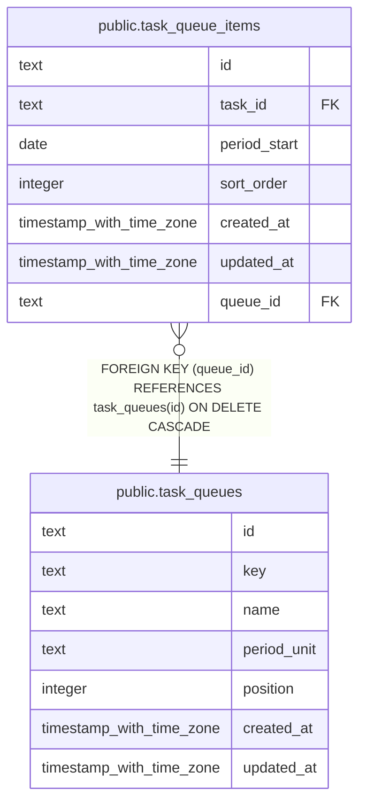

# public.task_queues

## Columns

| Name        | Type                     | Default | Nullable | Children                                              | Parents | Comment |
| ----------- | ------------------------ | ------- | -------- | ----------------------------------------------------- | ------- | ------- |
| id          | text                     |         | false    | [public.task_queue_items](public.task_queue_items.md) |         |         |
| key         | text                     |         | false    |                                                       |         |         |
| name        | text                     |         | false    |                                                       |         |         |
| period_unit | text                     |         | true     |                                                       |         |         |
| position    | integer                  | 0       | false    |                                                       |         |         |
| created_at  | timestamp with time zone | now()   | false    |                                                       |         |         |
| updated_at  | timestamp with time zone | now()   | false    |                                                       |         |         |

## Constraints

| Name                          | Type        | Definition                                                                                               |
| ----------------------------- | ----------- | -------------------------------------------------------------------------------------------------------- |
| task_queues_period_unit_check | CHECK       | CHECK (((period_unit IS NULL) OR (period_unit = ANY (ARRAY['day'::text, 'week'::text, 'month'::text])))) |
| task_queues_pkey              | PRIMARY KEY | PRIMARY KEY (id)                                                                                         |
| task_queues_key_unique        | UNIQUE      | UNIQUE (key)                                                                                             |

## Indexes

| Name                   | Definition                                                                         |
| ---------------------- | ---------------------------------------------------------------------------------- |
| task_queues_pkey       | CREATE UNIQUE INDEX task_queues_pkey ON public.task_queues USING btree (id)        |
| task_queues_key_unique | CREATE UNIQUE INDEX task_queues_key_unique ON public.task_queues USING btree (key) |

## Relations

---

> Generated by [tbls](https://github.com/k1LoW/tbls)
