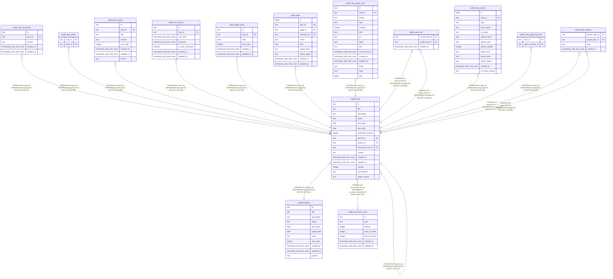

# public.tasks

## Columns

| Name               | Type                     | Default          | Nullable | Children                                                                                                                                                                                                                                                                                                                                                                                                                                                                                                                                                  | Parents                                               | Comment |
| ------------------ | ------------------------ | ---------------- | -------- | --------------------------------------------------------------------------------------------------------------------------------------------------------------------------------------------------------------------------------------------------------------------------------------------------------------------------------------------------------------------------------------------------------------------------------------------------------------------------------------------------------------------------------------------------------- | ----------------------------------------------------- | ------- |
| id                 | text                     |                  | false    | [public.task_comments](public.task_comments.md) [public.task_labels](public.task_labels.md) [public.task_pages](public.task_pages.md) [public.tasks](public.tasks.md) [public.time_blocks](public.time_blocks.md) [public.today_tasks](public.today_tasks.md) [public.edits](public.edits.md) [public.task_github_links](public.task_github_links.md) [public.task_links](public.task_links.md) [public.task_events](public.task_events.md) [public.task_agent_sessions](public.task_agent_sessions.md) [public.task_relations](public.task_relations.md) |                                                       |         |
| title              | text                     |                  | false    |                                                                                                                                                                                                                                                                                                                                                                                                                                                                                                                                                           |                                                       |         |
| description        | text                     |                  | true     |                                                                                                                                                                                                                                                                                                                                                                                                                                                                                                                                                           |                                                       |         |
| status             | text                     | 'todo'::text     | false    |                                                                                                                                                                                                                                                                                                                                                                                                                                                                                                                                                           |                                                       |         |
| start_date         | date                     |                  | true     |                                                                                                                                                                                                                                                                                                                                                                                                                                                                                                                                                           |                                                       |         |
| due_date           | date                     |                  | true     |                                                                                                                                                                                                                                                                                                                                                                                                                                                                                                                                                           |                                                       |         |
| estimated_minutes  | integer                  |                  | true     |                                                                                                                                                                                                                                                                                                                                                                                                                                                                                                                                                           |                                                       |         |
| parent_id          | text                     |                  | true     |                                                                                                                                                                                                                                                                                                                                                                                                                                                                                                                                                           | [public.tasks](public.tasks.md)                       |         |
| project_id         | text                     |                  | true     |                                                                                                                                                                                                                                                                                                                                                                                                                                                                                                                                                           | [public.projects](public.projects.md)                 |         |
| recurrence_rule_id | text                     |                  | true     |                                                                                                                                                                                                                                                                                                                                                                                                                                                                                                                                                           | [public.recurrence_rules](public.recurrence_rules.md) |         |
| context            | text                     | 'personal'::text | false    |                                                                                                                                                                                                                                                                                                                                                                                                                                                                                                                                                           |                                                       |         |
| created_at         | timestamp with time zone | now()            | false    |                                                                                                                                                                                                                                                                                                                                                                                                                                                                                                                                                           |                                                       |         |
| updated_at         | timestamp with time zone | now()            | false    |                                                                                                                                                                                                                                                                                                                                                                                                                                                                                                                                                           |                                                       |         |
| number             | integer                  |                  | false    |                                                                                                                                                                                                                                                                                                                                                                                                                                                                                                                                                           |                                                       |         |
| commitment         | text                     | 'inbox'::text    | false    |                                                                                                                                                                                                                                                                                                                                                                                                                                                                                                                                                           |                                                       |         |
| status_reason      | text                     |                  | true     |                                                                                                                                                                                                                                                                                                                                                                                                                                                                                                                                                           |                                                       |         |

## Constraints

| Name                                            | Type        | Definition                                                                          |
| ----------------------------------------------- | ----------- | ----------------------------------------------------------------------------------- |
| tasks_status_reason_check                       | CHECK       | CHECK (((status = 'completed'::text) OR (status_reason IS NULL)))                   |
| tasks_project_id_projects_id_fk                 | FOREIGN KEY | FOREIGN KEY (project_id) REFERENCES projects(id) ON DELETE SET NULL                 |
| tasks_recurrence_rule_id_recurrence_rules_id_fk | FOREIGN KEY | FOREIGN KEY (recurrence_rule_id) REFERENCES recurrence_rules(id) ON DELETE SET NULL |
| tasks_parent_id_tasks_id_fk                     | FOREIGN KEY | FOREIGN KEY (parent_id) REFERENCES tasks(id) ON DELETE SET NULL                     |
| tasks_pkey                                      | PRIMARY KEY | PRIMARY KEY (id)                                                                    |
| tasks_number_unique                             | UNIQUE      | UNIQUE (number)                                                                     |

## Indexes

| Name                     | Definition                                                                             |
| ------------------------ | -------------------------------------------------------------------------------------- |
| tasks_pkey               | CREATE UNIQUE INDEX tasks_pkey ON public.tasks USING btree (id)                        |
| idx_tasks_parent_id      | CREATE INDEX idx_tasks_parent_id ON public.tasks USING btree (parent_id)               |
| idx_tasks_status         | CREATE INDEX idx_tasks_status ON public.tasks USING btree (status)                     |
| idx_tasks_start_date     | CREATE INDEX idx_tasks_start_date ON public.tasks USING btree (start_date)             |
| idx_tasks_due_date       | CREATE INDEX idx_tasks_due_date ON public.tasks USING btree (due_date)                 |
| idx_tasks_project_id     | CREATE INDEX idx_tasks_project_id ON public.tasks USING btree (project_id)             |
| idx_tasks_project_status | CREATE INDEX idx_tasks_project_status ON public.tasks USING btree (project_id, status) |
| tasks_number_unique      | CREATE UNIQUE INDEX tasks_number_unique ON public.tasks USING btree (number)           |
| idx_tasks_commitment     | CREATE INDEX idx_tasks_commitment ON public.tasks USING btree (commitment)             |

## Relations

---

> Generated by [tbls](https://github.com/k1LoW/tbls)
