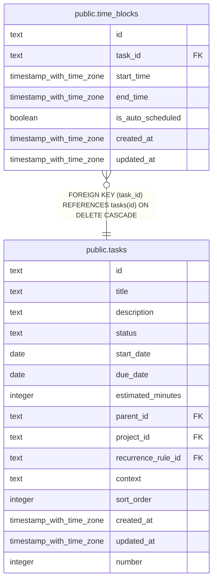

# public.time_blocks

## Columns

| Name | Type | Default | Nullable | Children | Parents | Comment |
| ---- | ---- | ------- | -------- | -------- | ------- | ------- |
| id | text |  | false |  |  |  |
| task_id | text |  | false |  | [public.tasks](public.tasks.md) |  |
| start_time | timestamp with time zone |  | false |  |  |  |
| end_time | timestamp with time zone |  | false |  |  |  |
| is_auto_scheduled | boolean | false | false |  |  |  |
| created_at | timestamp with time zone | now() | false |  |  |  |
| updated_at | timestamp with time zone | now() | false |  |  |  |

## Constraints

| Name | Type | Definition |
| ---- | ---- | ---------- |
| time_blocks_task_id_tasks_id_fk | FOREIGN KEY | FOREIGN KEY (task_id) REFERENCES tasks(id) ON DELETE CASCADE |
| time_blocks_pkey | PRIMARY KEY | PRIMARY KEY (id) |

## Indexes

| Name | Definition |
| ---- | ---------- |
| time_blocks_pkey | CREATE UNIQUE INDEX time_blocks_pkey ON public.time_blocks USING btree (id) |
| idx_time_blocks_task_id | CREATE INDEX idx_time_blocks_task_id ON public.time_blocks USING btree (task_id) |
| idx_time_blocks_date_range | CREATE INDEX idx_time_blocks_date_range ON public.time_blocks USING btree (start_time, end_time) |

## Relations

---

> Generated by [tbls](https://github.com/k1LoW/tbls)
