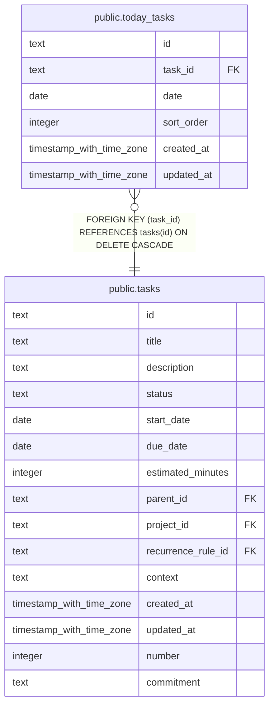

# public.today_tasks

## Columns

| Name       | Type                     | Default | Nullable | Children | Parents                         | Comment |
| ---------- | ------------------------ | ------- | -------- | -------- | ------------------------------- | ------- |
| id         | text                     |         | false    |          |                                 |         |
| task_id    | text                     |         | false    |          | [public.tasks](public.tasks.md) |         |
| date       | date                     |         | false    |          |                                 |         |
| sort_order | integer                  | 0       | false    |          |                                 |         |
| created_at | timestamp with time zone | now()   | false    |          |                                 |         |
| updated_at | timestamp with time zone | now()   | false    |          |                                 |         |

## Constraints

| Name                            | Type        | Definition                                                   |
| ------------------------------- | ----------- | ------------------------------------------------------------ |
| today_tasks_task_id_tasks_id_fk | FOREIGN KEY | FOREIGN KEY (task_id) REFERENCES tasks(id) ON DELETE CASCADE |
| today_tasks_pkey                | PRIMARY KEY | PRIMARY KEY (id)                                             |

## Indexes

| Name             | Definition                                                                  |
| ---------------- | --------------------------------------------------------------------------- |
| today_tasks_pkey | CREATE UNIQUE INDEX today_tasks_pkey ON public.today_tasks USING btree (id) |

## Relations

---

> Generated by [tbls](https://github.com/k1LoW/tbls)
